1. [Introduzione](#introduzione)

  - [Informazioni sul progetto](#informazioni-sul-progetto)

  - [Abstract](#abstract)

  - [Scopo](#scopo)

2. [Analisi](#analisi)

  - [Analisi del dominio](#analisi-del-dominio)

  - [Analisi dei mezzi](#analisi-dei-mezzi)

  - [Analisi e specifica dei requisiti](#analisi-e-specifica-dei-requisiti)

  - [Use case](#use-case)

  - [Pianificazione](#pianificazione)

3. [Progettazione](#progettazione)

  - [Design dell’architettura del sistema](#design-dell’architettura-del-sistema)

  - [Design dei dati e database](#design-dei-dati-e-database)

4. [Implementazione](#implementazione)

  - [Sito Internet](#Sito)

  - [Hardware e codice](#Hardware-e-codice)

  - [Database](#Database)

5. [Test](#test)

  - [Protocollo di test](#protocollo-di-test)

  - [Risultati test](#risultati-test)

  - [Mancanze e limitazioni conosciute](#mancanze-e-limitazioni-conosciute)

6. [Consuntivo](#consuntivo)

7. [Conclusioni](#conclusioni)

  - [Sviluppi futuri](#sviluppi-futuri)

  - [Considerazioni personali](#considerazioni-personali)

8. [Sitografia](#sitografia)

9. [Allegati](#allegati)


## Introduzione

### Informazioni sul progetto

- Allievi:

	Daniel Matt (Sviluppatore)

	Georgiy Farina (Sviluppatore)

	Marco Lorusso (Sviluppatore)

	Matthias Iannarella (Sviluppatore)

- Docenti: Luca Muggiasca (Cliente)

- Scuola: SAMT (Scuola d'arti e Mestieri Trevano)

- Sezione: Informatica

- Materia: Modulo 306 - Realizzare un piccolo proggetto IT

- Data inizio: 18 gennaio 2020

- Termine di consegna: 08 maggio 2020

### Abstract

  E’ una breve e accurata rappresentazione dei contenuti di un documento,
  senza notazioni critiche o valutazioni. Lo scopo di un abstract efficace
  dovrebbe essere quello di far conoscere all’utente il contenuto di base
  di un documento e metterlo nella condizione di decidere se risponde ai
  suoi interessi e se è opportuno il ricorso al documento originale.

  Può contenere alcuni o tutti gli elementi seguenti:

  -   **Background/Situazione iniziale**

  -   **Descrizione del problema e motivazione**: Che problema ho cercato
      di risolvere? Questa sezione dovrebbe includere l'importanza del
      vostro lavoro, la difficoltà dell'area e l'effetto che potrebbe
      avere se portato a termine con successo.

  -   **Approccio/Metodi**: Come ho ottenuto dei progressi? Come ho
      risolto il problema (tecniche…)? Quale è stata l’entità del mio
      lavoro? Che fattori importanti controllo, ignoro o misuro?

  -   **Risultati**: Quale è la risposta? Quali sono i risultati? Quanto è
      più veloce, più sicuro, più economico o in qualche altro aspetto
      migliore di altri prodotti/soluzioni?

  Esempio di abstract:

  > *As the size and complexity of today’s most modern computer chips
  > increase, new techniques must be developed to effectively design and
  > create Very Large Scale Integration chips quickly. For this project, a
  > new type of hardware compiler is created. This hardware compiler will
  > read a C++ program, and physically design a suitable microprocessor
  > intended for running that specific program. With this new and powerful
  > compiler, it is possible to design anything from a small adder, to a
  > microprocessor with millions of transistors. Designing new computer
  > chips, such as the Pentium 4, can require dozens of engineers and
  > months of time. With the help of this compiler, a single person could
  > design such a large-scale microprocessor in just weeks.*

### Scopo
  Lo scopo di questo progetto è quello di avere una costante misurazione tramite una struttura di registrazione, insieme alla relativa rappresentazione su un sito web, delle vibrazioni terrestri.
  Nel caso di un terremoto devono essere notificati gli admin via mail e gli utenti sul sito.

## Analisi

### Analisi del dominio

Il prodotto finale potrà essere utilizzato da tutti gli utenti, sia esperti,
sia principianti, che hanno a disposizione un dispositivo in grado di navigare su internet.
Chiunque può consultare il sito che conterrà una rappresentazione delle misurazioni delle scosse sismiche sotto forma di grafico e tabella, una pagina dei terremoti più percepiti in Svizzera e nel mondo, e infine una pagina di descrizione del progetto.

Attualmente esiste già un sito nazionale dedicato a questo tema, speriamo che la nostra versione sia più piacevole ed efficace.

### Analisi e specifica dei requisiti

  | **ID**  | **Requisito** | **Priorità** | **Versione** | **Note** |
  | ------- | ------------- | ------------ | ------------ | -------- |
  | REQ-001 | Bisogna avere un sito per la visualizzazione di dati| 1 | 1.0  | http://sismolive.online        |
  | REQ-002 |Il sito deve avere il collegamento ad un DB| 1 | 1.0  |          |
  | REQ-003 | Il sito deve avere una pagina di login| 1 | 1.0  |  Con credenziali solo per amministratori        |
  | REQ-004 | Dev'esserci una struttura hardware con Arduino| 1 | 1.0 | |
  | REQ-005 | L'Arduino deve poter leggere i dati da un componente che misura le vibrazioni| 1 | 1.0 | Il componente in questione è un geofono|
  | REQ-006 | L'arduino deve poter mandare i dati tramite modulo Wi-Fi| 1 | 1.0| |
  | REQ-007 |Il sito dev'essere compatibile con i principali browser| 1 | 2.0 | |
  | REQ-008 | I dati sul sito devono essere rappresentati sotto forma di grafici | 1 | 1.0 |          |
  | REQ-009 | Deve esistere un DB per il salvataggio dei vari dati | 1 | 1.0 | |
  | REQ-010 | Il dato live viene mostrato su un LCD attaccato all'Arduino | 3 | 1.0 |     |
  | REQ-011 | L'admin deve poter configurare le  soglie (minima e critica) dei dati  | 1 | 1.0 |  |
  | REQ-012 | Il dato live viene mostrato sul sito| 2 | 1.0 |  |
  | REQ-013 | In caso di terremoto gli admin vengono notificati via mail  | 1 | 1.0 |  |
  | REQ-014 | In caso di terremoto gli admin vengono notificati via messaggio| 4 | 1.0 | |
  | REQ-015 | Per il progetto è necessario avere un agenda su TRELLO | 2 | 1.0 | |
  | REQ-016 | I dati vengono letti con frequenza configurata dall'admin| 1 | 1.0 | |

### Use case

I casi d’uso rappresentano l’interazione tra i vari attori e le
funzionalità del prodotto.

### Pianificazione

- Gantt preventivo:

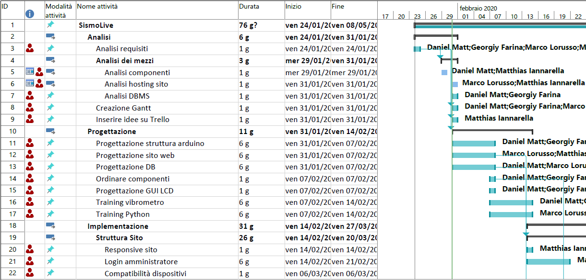
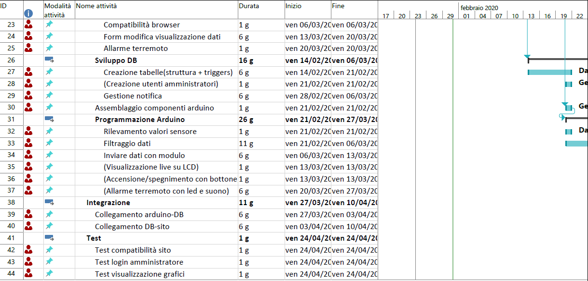
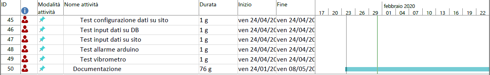
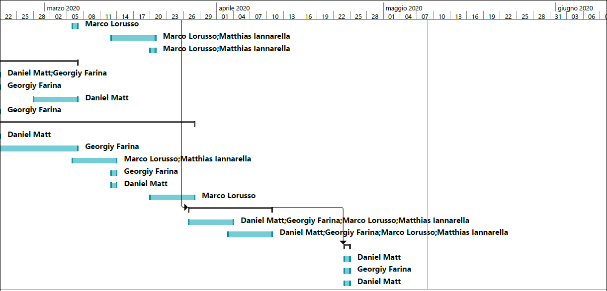

### Analisi dei mezzi

#### Hardware

Matthias:

- ASUS ROG GL553VE, Windows 10 Home 64 bit, versione 1903 build 18362.535.

Marco:

- Acer Aspire VN7-572G, Windows 10 home 64 bit

Georgiy:
- Acer Aspire A717-71G, Windows 10 home 64 bit

Daniel:
- ASUS X556UAM, Windows 10 home 64 bit

Sismografo:
- Arduino Mega 2560
- Fishino

#### Software

- Lunacy v4.6.1

- Atom v1.40.1

- Microsoft Project 2019 v16

- GitHub Desktop v2.1.3

- Google Chrome v79.0.3945.79

- XAMPP v3.2.4

- MySQL Workbench 8.0 CE

- Arduino IDE v1.8.33.0

- Sublime text 3

#### Librerie


## Progettazione


### Design dell’architettura del sistema

- Fishino:

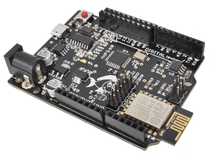
<br>
La scheda FishinoUNO é la prima scheda di fishino, compatibile al 100% con Arduino UNO ma con molti componenti aggiuntivi che aumentano le potenzialità di questa scheda. I componenti aggiuntivi sono:
  - Modulo WIFI : utile alla connessione della scheda a una rete wifi
  - Slot MicroSD: permette alla scheda fishino di utilizzare grandi quantità di dati
  - Modulo RTC : permette alla scheda di conoscere in tempo reale anche senza alimentazione, (funziona a batteria), l'ora esatta
  - Alimentazione 3.3V potenziata
  - É compatibile con le schede millefori

Sitemap:

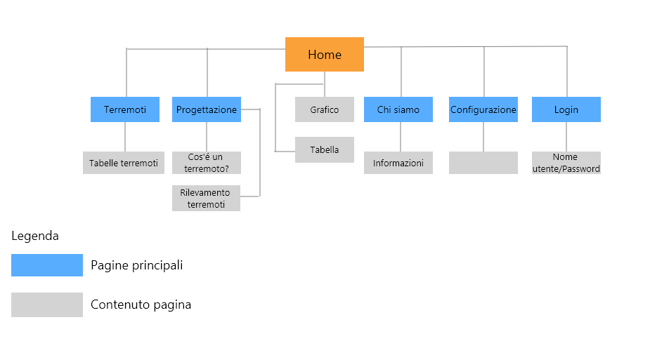

### Design dei dati e database

Descrizione delle strutture di dati utilizzate dal programma in base
agli attributi e le relazioni degli oggetti in uso.

### Schema E-R, schema logico e descrizione.

Se il diagramma E-R viene modificato, sulla doc dovrà apparire l’ultima
versione, mentre le vecchie saranno sui diari.

### Design delle interfacce

Progettazione pagina principale:


Progettazione Login:


Progettazione terremoti:


Progettazione Menu a tendina:

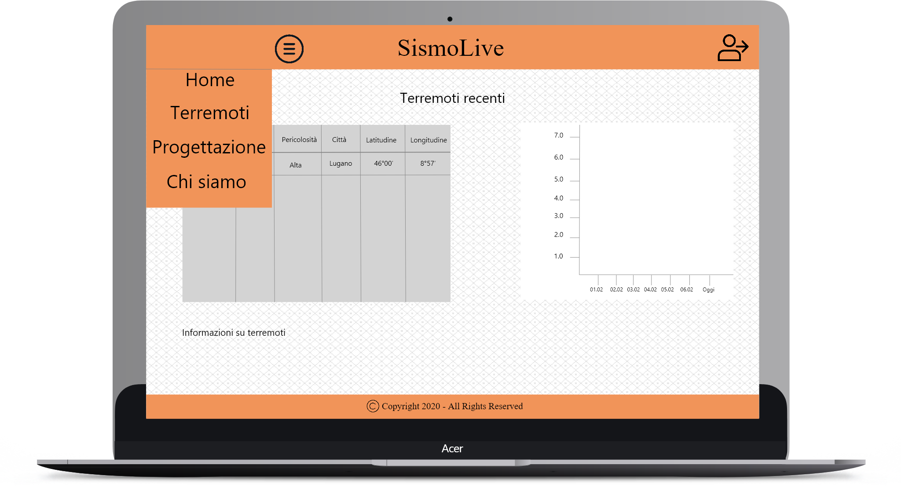

Progettazione pagina progettazione:

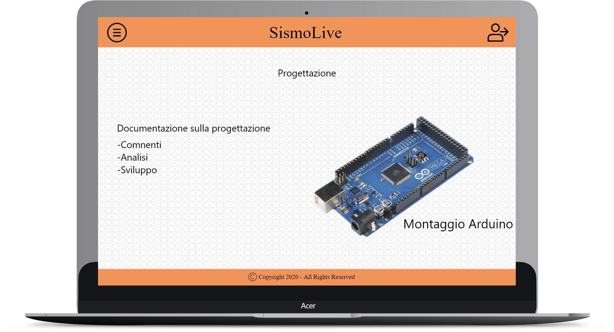


### Design procedurale

Descrive i concetti dettagliati dell’architettura/sviluppo utilizzando
ad esempio:

-   Diagrammi di flusso e Nassi.

-   Tabelle.

-   Classi e metodi.

-   Diritti di accesso a condivisioni …

## Implementazione

### Sito

#### config.php

Costanti definite

```php
//IP del database
define('DB_SERVER', '160.153.133.208');
// Utente del database
define('DB_USERNAME', 'sismo');
// Password dell'utente
define('DB_PASSWORD', 'simo');
// Database a quale accedere
define('DB_NAME', 'SismoLive');
```

#### connectToDB.php

Tenta di connettersi al database, ma se la connessione fallisce stampa l'errore.

```php
// Include il file da dove prendere le varie variabili
include "config.php";
// Tentativo di connesione al database
$link = mysqli_connect(DB_SERVER, DB_USERNAME, DB_PASSWORD, DB_NAME);
// Controlla la connessione se è andata a buon fine
if ($link === false) {
    die("ERROR: Could not connect. " . mysqli_connect_error());
}
```

#### login.php

La password inserita nel login viene criptata con l'hash md5, se essa equivale alla password trovata nel database, esegue l'accesso.
Sennò verrà stampato un errore cons critto "Password errata!".

```php
if (md5($password) == $pass) {
    // La password è corretta e quindi inizia la sessione
    session_start();
    // Salva i dati nelle variabili di sessione
    $_SESSION["loggedin"] = true;
    $_SESSION["username"] = $username;
    $_SESSION["error"] = "";
    $_SESSION["errorLogin"] = "";
    header("location: ../index.php");
} else {
    $_SESSION["errorLogin"] = "Password errata!";
    header("location: ../html/login.php");
}
```

#### logout.php

Esegue l'unset di tutte le variabili della sessione.
Distrugge la sessione e infine reindirizza l'utente alla pagina principale.

```php
// Inizializza la sessione
session_start();
// Esegue l'unset di tutte le variabili di sessione
$_SESSION = array();
// Distrugge la sessione
session_destroy();
// Reindirizza alla pagina principale
header("location: ../index.php");
exit;
```

#### table.php

```php
// Apre il csv di riferimento
$f = fopen("../csv/mondo.csv", "r");
// Legge il contenuto del file
$fr = fread($f, filesize("../csv/mondo.csv"));
// Chiude il file
fclose($f);
//Rimuove tutti le nuove righe
$lines = explode("\n\r", $fr);
```


```php
$check = 0;
for ($i = 0;$i < count($lines);$i++) {
  // Se è nella prima riga, crea l'header della taballa
    if ($check == 0) {
        echo "<thead class='thead-dark'>";
        echo "<tr>";
        $cells = array();
        // Toglie ; da tutti i dati
        $cells = explode(";", $lines[$i]);
        for ($k = 0;$k < count($cells);$k++) {
            echo "<th scope='col'>" . $cells[$k] . "</th>";
        }
        echo "</tr>";
        echo "</thead>";
        echo "</tbody>";
    } else {
        echo "<tr>";
        $cells = array();
          // Toglie ; da tutti i dati
        $cells = explode(";", $lines[$i]);
        for ($k = 0;$k < count($cells);$k++) {
            echo "<td>" . $cells[$k] . "</td>";
        }
        echo "</tr>";
    }
    $check++;
}
```

#### csv

Esempio del formato in csv, ogni campo è separatao da un ";".

```csv
Data;Magnitudo;Pericolosità;Città

1960.05.22;9.5;Molto alta;Valdivia, Cile

1964.03.27;9.2;Molto alta;Stretto di Prince William, Alaska (Stati Uniti)

2004.12.26;9.1;Molto alta;Oceano Indiano, Sumatra, Indonesia

2011.03.11;9.0;Molto alta;Oceano Pacifico, Regione di Tohoku, Giappone

1952.11.04;9.0;Molto alta;Kamcatka, Russia (all'epoca in URSS)

1868.08.13;9.0;Molto alta;Arica, Cile

1700.01.26;8.7;Molto alta;Oceano Pacifico, USA e Canada

1869.07.09;8.9;Molto alta;Oceano Pacifico, Regione di Tohoku, Giappone

1611.12.02;8.9;Molto alta;Oceano Pacifico, Hokkaido, Giappone

1762.04.02;8.8;Molto alta;Chittagong, Bangladesh
```

#### logged.php

Se l'utente ha effettuato il login, mostrerà i bottoni per accedere
alla pagina dei parametri oppure per disconnetersi.
Se invece non ha effettuato il login, mostrerà solamente il bottone per accedere.

```php
$login = "http://sismolive.online/html/login.html";
$logout = "http://sismolive.online/php/logout.php";
$parametri = "http://sismolive.online/html/configurazione.php";
// Se l'utente è loggato mostrerà il tasto di logout e per accedere alla configurazione dei parametri, sennò comparirà solamente il tasto per effettuare il login.
if (!isset($_SESSION["loggedin"]) || $_SESSION["loggedin"] !== true) {
    echo "<li class='get-started'><a href='$login'>Login</a></li>";
} else {
    echo "<li class='get-started'><a href='$parametri'>Parametri</a></li>";
    echo "<li class='get-started'><a href='$logout'>Logout</a></li>";
}
```

#### getSoglie.php

Necessita del file **config.php** per effettuare la connesione al database.
Esegue una query e se nel risultato generato c'è almeno una riga, esegue un ciclo while
settando le variabili **$soglia_minima**, **$soglia_intermedia** e **$soglia_critica**.

```php
// Include il file che effettua la connessione al database
include "connectToDB.php";
$soglia_minima = '';
$soglia_critica = '';
$soglia_intermedia = '';
// Query
$soglie = "SELECT soglia_minima, soglia_intermedia, soglia_critica FROM Configurazione";
$result = $link->query($soglie);
if ($result->num_rows > 0) {
    while ($row = $result->fetch_assoc()) {
        $soglia_minima = $row['soglia_minima'];
        $soglia_intermedia = $row['soglia_intermedia'];
        $soglia_critica = $row['soglia_critica'];
    }
}
```

#### mail.php

Funzione

```php
require "PHPMailer/PHPMailerAutoload.php";
require "../config.php";
function smtpmailer($to, $from, $from_name, $subject, $body) {
    $mail = new PHPMailer();
    $mail->IsSMTP();
    $mail->SMTPAuth = true;
    $mail->SMTPSecure = 'ssl';
    $mail->Host = 'n3plcpnl0298.prod.ams3.secureserver.net';
    $mail->Port = 465;
    $mail->Username = 'terremoto@sismolive.online';
    $mail->Password = 'terremoto';
    $mail->IsHTML(true);
        //Indirizzo mail mittente
    $mail->From = "terremoto@sismolive.online";
        //Nome mittente
    $mail->FromName = $from_name;
    $mail->Sender = $from;
    $mail->AddReplyTo($from, $from_name);
        //Oggetto della mail
    $mail->Subject = $subject;
        //Contenuto della mail
    $mail->Body = $body;
        //Destinatario
    $mail->AddAddress($to);
    //Invio la mail
    $mail->Send();
}
```

```php
$from = 'terremoto@sismolive.online';
$name = 'SismoLive';
$subj = 'Allarme terremoto!';
$msg = 'È stato rilevato un terremoto di magnitudo .. ' . ' alle .. ';
$email = "SELECT email FROM Utente";
$result = $link->query($email);
if ($result->num_rows > 0) {
    while ($row = $result->fetch_assoc()) {
        $to = $row['email'];
        $error = smtpmailer($to, $from, $name, $subj, $msg);
    }
}
```

#### data.php

Necessita del file **config.php** per effettuare la connesione al database.
Esegue una query e se nel risultato generato c'è almeno una riga, esegue un ciclo while
settando le variabili **$prarop** e **$magnitudo**.
Infine esegue un trim togliendo le virgole da entrambe le variabili.

```php
// Include il file che effettua la connessione al database
include "../php/connectToDB.php";

$orario = '';
$magnitudo = '';
$terremoti = "SELECT * from tabella";
$result = $link->query($terremoti);
if ($result->num_rows > 0)
{
    while ($row = $result->fetch_assoc())
    {
        $orario = $orario . '"' . $row['orario_registrazione'] . '",';
        $magnitudo = $magnitudo . '"' . $row['magnitudo'] . '",';
    }
}

$orario = trim($orario, ",");
$magnitudo = trim($magnitudo, ",");

```

Esegue una query e se nel risultato generato c'è almeno una riga, crea la tabella in base ai valori
pescati dal database.

```php

$terremoti = "SELECT * from tabella";
$result = $link->query($terremoti);
if ($result->num_rows > 0)
{
  while ($row = $result->fetch_assoc())
  {
    echo "<tr><th>" . $row["data_registrazione"] . "</th><th>" . $row["orario_registrazione"] . "</th><th>" . $row["magnitudo"] . "</tr>";
  }
}

```

#### sms.php

Alla fine invia il messaggio.

```php
require_once ('messagebird/vendor/autoload.php');
// Chiave API
$MessageBird = new \MessageBird\Client('');
$Message = new \MessageBird\Objects\Message();
//Nome del mittente
$Message->originator = 'SismoLive';
//Numero del destinatario
$Message->recipients = ['+41789246797'];
//Messaggio da mandare
$Message->body = 'Allarme terremoto!';
//Invia il messaggio
try {
    $MessageResult = $MessageBird->messages->create($Message);
}
catch(\MessageBird\Exceptions\AuthenticateException $e) {
    // Significa che la chiavi API è sbagliata
    echo 'Chiave API errata';
}
catch(\MessageBird\Exceptions\BalanceException $e) {
    // Significa che il credito è finito
    echo 'Credito finito';
}
catch(\Exception $e) {
    echo $e->getMessage();
}

```

#### Ricarica pagina

Ogni 1000 millisecondi, ovvero ogni secondo fa le query per vedere se ci sono terremoto nuovi.
Questo rende sia il grafico sia la tabella in modalità "real-time".

```javascript
$('#responsecontainer').load('data.php');
var refreshId = setInterval(function() {
    $('#responsecontainer').load('data.php');
}, 1000);
```

#### Ordinare tabella

Permette di ordinare le tabelle per data, orario e magnitudo.

```javascript
const getCellValue = (tr, idx) => tr.children[idx].innerText || tr.children[idx].textContent;
const comparer = (idx, asc) => (a, b) => ((v1, v2) => v1 !== '' && v2 !== '' && !isNaN(v1) && !isNaN(v2) ? v1 - v2 : v1.toString().localeCompare(v2))(getCellValue(asc ? a : b, idx), getCellValue(asc ? b : a, idx));

// do the work...
document.querySelectorAll('th').forEach(th => th.addEventListener('click', (() => {
    const table = th.closest('table');
    const tbody = table.querySelector('tbody');
    Array.from(tbody.querySelectorAll('tr')).sort(comparer(Array.from(th.parentNode.children).indexOf(th), this.asc = !this.asc)).forEach(tr => tbody.appendChild(tr));
})));
```

#### Header

Esempio di header per ogni pagina, nell'ultima voce viene chiamato in causa il file che decide
se mostrare il bottone di login oppure i bottoni per effettuare il logout o settare le soglie.

```html
<nav class="nav-menu d-none d-lg-block">
  <ul>
    <li class="active"><a href="#header">Home</a></li>
    <li ><a href="html/terremoti_attuali.php">Terremoti Attuali</a></li>
    <li><a href="html/terremoti.php">Terremoti</a></li>
    <li><a href="html/progettazione.php">Progettazione</a></li>
    <li><a href="html/chisiamo.php">Chi siamo</a></li>
    <?php require_once "php/logged.php";?>
  </ul>
</nav>
```

### SQL

Elimina il database se esiste, dopodichè lo crea e viene selezionato.

```sql
# Script che crea il database del progetto SismoLive

drop database if exists SismoLive;
create database SismoLive;
use SismoLive;

# CREAZIONE TABELLE  ------------------------------

drop table if exists Utente;
create table Utente(
	nome varchar(20) primary key not null,
	psw varchar(100) not null,
	email varchar(50) not null,
	telefono long not null,
	tipo varchar(20) not null
);

drop table if exists Configurazione;
create table Configurazione(
	id int primary key auto_increment,
	soglia_minima double not null, #Soglia per registrare il valore nella tabella Terremoto
    soglia_intermedia double not null, # Soglia per mandare la mail
    soglia_critica double not null # Soglia per mandare l'SMS'
);

drop table if exists Terremoto;
create table Terremoto(
	id_registrazione int primary key not null,
    magnitudo double not null,
	data_registrazione DATE not null,
    orario_registrazione TIME not null
);

# AMMINISTRATORI DI BASE --------------------------

insert into Utente(nome,psw,email,telefono,tipo) values ("Georgiy",md5("PasswordDiGeorgiy"),"georgiy.farina@samtrevano.ch",41790123456,"A");
insert into Utente(nome,psw,email,telefono,tipo) values ("Marco",md5("PasswordDiMarco"),"marco.lorusso@samtrevano.ch",41791234567,"A");
insert into Utente(nome,psw,email,telefono,tipo) values ("Matthias",md5("PasswordDiMatthias"),"matthias.iannarella@samtrevano.ch", 41789246797,"A");
insert into Utente(nome,psw,email,telefono,tipo) values ("Daniel",md5("PasswordDiDaniel"),"daniel.matt@samtrevano.ch",41793456789,"A");
insert into Utente(nome,psw,email,telefono,tipo) values ("test",md5("test"),"thias.ianna@gmail.com",41793456789,"A");

# CONFIGURAZIONE DI 'DEFAULT' --------------

insert into Configurazione(soglia_minima,soglia_intermedia,soglia_critica) values(3.0,6.0,7.5);

# FUNZIONI VARIE  ---------------------

DELIMITER //
CREATE FUNCTION getStartId()
returns int deterministic
BEGIN
	declare startId int;
	set startId = (select max(id_registrazione) -7 from Terremoto);
    if startId < 0 then
		set startId = 0;
    end if;
    return startId;
END
//
DELIMITER ;

DELIMITER //
CREATE FUNCTION getFinishId()
returns int deterministic
BEGIN
	declare finishId int;
	set finishId = (select max(id_registrazione) from Terremoto);
    return finishId;
END
//
DELIMITER ;

#------------------------------------

drop view if exists tabella;
create view tabella as select t.data_registrazione, t.orario_registrazione, t.magnitudo, t.id_registrazione from Terremoto t where t.id_registrazione > getStartId();

```


Il luogo dove tutto viene visualizzato; i dati statistici e altre Informazioni riguardanti il progetto.<br>
Qui vengono mostrati agli utenti, in tempo reale i dati presi dall'arduino che si aggiornano in continuazione e tramite una pagina di login, gli amministratori possono accedere e modificare vari parametri.
Per la struttura del sito abbiamo usato un bootstrap.

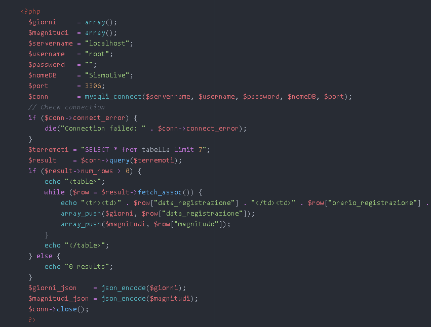

Questo pezzo di codice mostra come viene fatta la tabella con i dati del presi dal database, prima di tutto bisogna connettersi al database inserendo i parametri; nome del server, nome utente con cui si vuole accedere, password, nome del database e infine la porta.<br>
Dopo essere sicuri che la connessione è andata a buon fine, abbiamo fatto una query dove seleziona tutti i dati della tabella ma con un limite di dati che possono essere mostrati, in modo che la tabella non è così grande.<br>
Se la query ritorna correttamente, e ci sono dei dati all'interno della tabella, allora inserisce nella tabella i valori corrispondenti della data, ora e magnitudo.
<br>


Per il grafico abbiamo usato un canvas e tramite questo script si va a creare il grafico a linee con l'opzione di responsive attiva, con la data sull'asse delle X e il magnitudo sull'asse delle Y e con i vari parametri per lo stile. Arrivo fino ad un massimo di 5 dati visualizzati.

### Hardware e codice
<div style="text-align: justify">
La progettazione dell'hardware prevedeva l'uso di una board ArduinoWifi collegato al geofono e e a un display per mostrare la misurazione ottenuta direttamente sul luogo. Purtroppo noi abbiamo avuto un problema con l'ordine dei componenti che sono risultati dispersi. Quindi abbiamo deciso di svilluppare il progetto con un fishino UNO Rev2, una scheda compatibile con arduino e equipaggiata con un modulo per il WIFI. Per quanto riguarda i dati di misurazione, generiamo noi dei dati fittizi da inviare al server.
</div>

<div style="text-align: justify">
Abbiamo utilizzato ArduinoIDE. Se si ha problemi con le librerie di fishino consultare il diario del

[3.04.2020](../Diari/SismoLive_2020_04_03.md)
o il sito di <a href="https://fishino.it/download-libraries-it.html">fishino</a>.<br>
Per prima cosa si deve configurare le informazioni che ci serviranno per connetterci al wifi come:
<ul>
    <li>SSID: nome della rete</li>
    <li>Password: password del wifi</li>
    <li>IP gateway</li>
    <li>Subnetmask</li>
</ul>
L'IP del fishino verrà assegnato automaticamente dal DHCP del router, ma se si vuole si puo assegnare un IP fisso con la seguente riga di codice "#define IPADDR 192, 168, 1, 251". Quindi per fare questa configurazione bisognerà scrivere il seguente codice:<br>
<br>

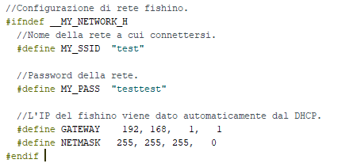

<br>
Dopo aver adattato lo sketch alla rete si deve poter connettere la scheda al WIFI appena configurato.
Il primo passo per connettere il fishino a una nuova rete é quello di resettarlo in modo da cancellare vecchie configurazioni sulla scheda.
<br>

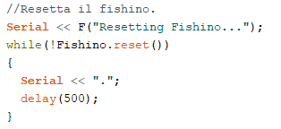
<br>
Dopodiché si imposta la modalità fisica a 11G e la modalità di operazione del fishino in <b>STATION_MODE</b>, cosifacendo si impone al fishino di dover collegarsi a una rete wifi già esistente. Infatti il fishino é in grado di creare un nuova rete con la modalità <b>SOFTAP_MODE</b>
<br>

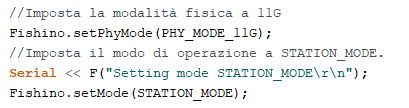
<br>

Ora si puó passare alla connessione al wifi. Con la soluzione da noi proposta se la rete non esiste o se si ha passato una password errata il programma continuerà a provare a connettersi all'infino finché non trova la rete con SSID e Password passati prima. Quindi il codice é il seguente:
<br>
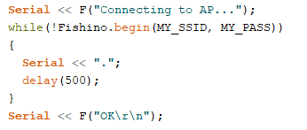
<br>

Infine manca solo l'acquisizione di un indirizzo IP dal DHCP. Per fare questo esiste il metodo <b>Fishino.staStartDHCP()</b>. Anche qui il programma aspetta all'infinito finche il fishino non ha ricevuto un IP dal DHCP.
<br>
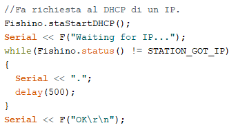
<br>

Adesso il fishino é connesso al wifi e manca solo di inviare i dati al nostro server.
<br>
Fishino invia i dati con il metodo POST, ma per prima cosa ci si deve connettere al host dove é presente il file php in cui andremo a ricevere i dati che invia il fishino. Il metodo che permette la connessione al host del server é <b>client.connect("www.sismolive.online",80)</b>, dove il primo parametro corrisponde all'host mentre il secondo é la prota su cui vogliamo conneterci.
Se la connessione all'host va a buon fine possiamo impostare il file che dovrà ricevere i dati, questo lo si fa con il meotodo <b>client.println(F("POST /Php/MySQL_connection.php HTTP/1.1"));</b>. Il percorso che si deve inserire é il percorso del file php partendo dall'host.
Poi bisogna riferire la lunghezza del dato che si vuole mandare, questo lo si puó ricavare con il metodo <b>length()</b>. Il metodo di invio dati alla fine risultera questo:
<br>
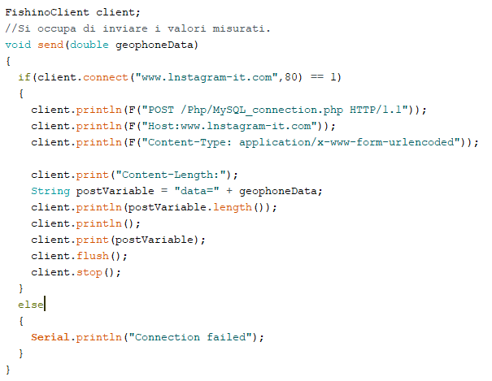
<br>
Il parametro passato non é altro che il valore che abbiamo creato il generatore di dati fittizzi. Il generatore di dati é un normalissimo random di numeri double in un range specificato con numero minimo e massimo (inclusi nella randomizzazione).
<br>
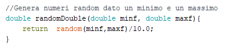
<br>

</div>

## Test

### Protocollo di test

|Test Case      | TC-001                       |
|---------------|--------------------------------------|
|**Nome**       |Presenza del sito|
|**Riferimento**|REQ-001|
|**Descrizione**| Bisogna verificare che esista il sito all'url: http://sismolive.online/index.php, e che tutte le pagine vengono visualizzate senza problemi.|
|**Prerequisiti**| --- |
|**Procedura**   | Aprire un browser ed andare sul seguente url: http://sismolive.online/index.php, controllare che il grafico e la tabella si vedono e si aggiornano ogni 5 secondi, aprire anche le altre sezioni del sito.|
|**Risultati attesi** | Deve apparire la pagina principale con grafico e tabella con dati al suo interno, ogni 5 secondi si deve poter vedere un miglioramento, non ci devono essere problemi di connessione al database o di altro genere.|


|Test Case      | TC-002                       |
|---------------|--------------------------------------|
|**Nome**       | Presenza di una pagina di login|
|**Riferimento**|REQ-003|
|**Descrizione**| Visitando il sito, deve esserci la possibilità di eseguire il login e collegarsi come amministratori.|
|**Prerequisiti**| Visitare il sito|
|**Procedura**   | Avere il sito su questo url: http://www.sismolive.online/index.php Dopodichè in alto a destra cliccare sul bottone "Login" inserire le credenziale: nome utente: test password: test. E controllare se una volta reindirizzato sulla pagina principale, spunta la parte di configurazione. |
|**Risultati attesi** | Dovrebbe apparire la pagina di login, e tramite le credenziali deve poter accedere come amministratore e avere la possibilità di aprire la pagina di configurazione e modificare i parametri.|


|Test Case      | TC-003                       |
|---------------|--------------------------------------|
|**Nome**       |Compatibilità coi principali browser|
|**Riferimento**|REQ-007|
|**Descrizione**| Il sito deve essere compatibile con i principali browser (Chrome, Opera, Firefox, Edge)|
|**Prerequisiti**| Avere il sito |
|**Procedura**   | Inserire l'url http://www.sismolive.online/index.php sui vari browser sopracitati, controllare se i grafici e la tabella si aggiornano ogni 5 secondi e che il login funzioni.|
|**Risultati attesi** | Dovrebbe apparire la pagina principale con i grafici e le tabelle e con possibilità di effettuare il login.|


|Test Case      | TC-004                       |
|---------------|--------------------------------------|
|**Nome**       | Presenza di un agenda di progetto su TRELLO|
|**Riferimento**|REQ-015|
|**Descrizione**| Dev'esserci un agenda di progetto su TRELLO |
|**Prerequisiti**| Tutti e 4 i componenti del gruppo e il docente perito del progetto devono avere un account|
|**Procedura**   | Visitare https://trello.com/b/fdVY0YLT/sismolive|
|**Risultati attesi** | Visitando l'agenda devono essere presenti le varie liste di attività|


|Test Case      | TC-005                       |
|---------------|--------------------------------------|
|**Nome**       |DB collegato al sito|
|**Riferimento**|REQ-002, REQ-009|
|**Descrizione**|Deve esistere un database collegato da remoto al sito|
|**Prerequisiti**||
|**Procedura**   |Connettersi al DB tramite WorkBench, provare ad aggiungere un record in Terremoto, in seguito aprire il sito e controllare se nella tabella e nel grafico viene visualizzato il record.|
|**Risultati attesi** |Sul sito dovrebbe apparire il nuovo record di terremoto, sia nella tabella che nel rispettivo grafico.|


|Test Case      | TC-006                       |
|---------------|--------------------------------------|
|**Nome**       |Grafici sul sito          |
|**Riferimento**|REQ-008|
|**Descrizione**|I dati sul sito devono essere rappresentati sotto forma di grafici.  |
|**Prerequisiti**|Avere dei dati da dover rappresentare.|
|**Procedura**   |Visitare http://www.sismolive.online/index.php e scorrere in basso, fino al grafico, dove ogni 5 secondi si deve aggiornare.|
|**Risultati attesi** |Si dovrebbe poter vedere il grafico dei terremoti che si aggiorna ogni 5 secondi, con accanto la rispettiva tabella|


|Test Case      | TC-007                       |
|---------------|--------------------------------------|
|**Nome**       |Struttura hardware con Fishino|
|**Riferimento**|REQ-004                     |
|**Descrizione**|La creazione dei dati deve avvenire da una struttura hardware con fishino.  |
|**Prerequisiti**|  |
|**Procedura**   |Controllare la struttura dell'arduino. |
|**Risultati attesi** |Deve esserci una struttura solida con arduino e ulteriori componenti collegati.  |


|Test Case      | TC-008                       |
|---------------|--------------------------------------|
|**Nome**       |Misurazione vibrazioni con geofono           |
|**Riferimento**|REQ-005                     |
|**Descrizione**|Tramite il geofono, bisogna poter prendere i dati che elabora con le vibrazioni del terreno, e poterli leggere nell'arduino.  |
|**Prerequisiti**|                           |
|**Procedura**   |Controllare se c'è il geofono e se l'arduino tramite un sistema di output, riceve i dati dal componente correttamente. |
|**Risultati attesi** |L'arduino deve stampare in console i vari valori delle frequenze che elabora il geofono.|


|Test Case      | TC-009                       |
|---------------|--------------------------------------|
|**Nome**       |Collegamento Fishino al WIFi          |
|**Riferimento**|REQ-006                     |
|**Descrizione**|La parte hardware del progetto deve poetr inviare dati tramite WIFI e quindi deve petersi collegare a internet.|
|**Prerequisiti**|  |
|**Procedura**   |Controllare che esista la rete con SSID e password definiti nel codice fishino.|
|**Risultati attesi** |La porta seriale a fine collegamento dovrebbe stampare lo stato della connessione.|


|Test Case      | TC-010                       |
|---------------|--------------------------------------|
|**Nome**       |Invio dati|
|**Riferimento**|REQ-006                  |
|**Descrizione**|L'invio dei dati avviene tramite il metodo post, verso un file php all'interno del sito internet. I dati inviati sono fittizi.|
|**Prerequisiti**|Riuscirsi a collegarsi a internet|
|**Procedura**   |Una volta collegati al wifi, il codice dovrebbe mandare i dati 5 volte al secondo tramite il metodo send.|
|**Risultati attesi** |Il fishino non da errori nell'invio di dati.|

|Test Case      | TC-011                      |
|---------------|--------------------------------------|
|**Nome**       |Inserimento nel DB dei dati|
|**Riferimento**|REQ-009                    |
|**Descrizione**|I dati ricevuti dal fishino devono essere inseriti in un db mysql.|
|**Prerequisiti**|Avere un sito funzionante e un DB per contenere i dati.|
|**Procedura**   |Controllare che il fishino sia connesso, verificare che il sito e il DB esistano, verificare nel codice arduno che il percorso per il file php sia corretto.|
|**Risultati attesi** |Nel DB dovrebbero essere stati inseriti i dati|

|Test Case      | TC-012                      |
|---------------|--------------------------------------|
|**Nome**       | Dato in live su LCD|
|**Riferimento**|REQ-010                       |
|**Descrizione**| Tramite un LCD montato sull'arduino, bisogna mostrare il dato appena registrato|
|**Prerequisiti**||
|**Procedura**   |Controllare sulla struttura se c'è un LCD montato e se mostra i dati in tempo reale. |
|**Risultati attesi** |Ci dovrebbe essere un LCD con i dati misurati/generati casualmente. |

|Test Case      | TC-013                      |
|---------------|--------------------------------------|
|**Nome**       |configurazione soglie da parte dell'admin |
|**Riferimento**|REQ-11                       |
|**Descrizione**| Gli amministratori possono configurare delle soglie, che corrispondono alla soglia minima e a quella massima. Settando la soglia minima, si potranno vedere i dati riguardanti il magnitudo sopra ad esso. Settando la soglia critica ad un certo valore, se si registra un magnitudo sopra quel valore, gli admin vengono avvisati tramite un'email.|
|**Prerequisiti**||
|**Procedura**   |Entrare nel sito, fare il login con il nome utente: test e la password: test. Inseguito aprire la pagina di configurazione dei parametri e settare un valore minimo e uno massimo. Infine controllare se sul grafico e sulla tabella escono solo i valori sopra la soglia e che se ci dovesse essere un terremoto di magnitudo sopra la soglia critica, arriva un'email. |
|**Risultati attesi** |La tabella e il grafico dovrebbero prendere in considerazione solo i dati sopra la soglia minima e si deve ricevere un'email se si supera la soglia critica. |

|Test Case      | TC-014                      |
|---------------|--------------------------------------|
|**Nome**       | Dato live sul sito|
|**Riferimento**|REQ-12                       |
|**Descrizione**|I dati che prende il sito, devono aggiornarsi in live sia sul grafico che sulla tabella, senza la necessità di riaggiornare la pagina ogni volta. |
|**Prerequisiti**||
|**Procedura**   |Aprire il sito, andare nella pagina dei terremoti attuali e aspettare fino a che il grafico e la tabella non cambia. |
|**Risultati attesi** |Il grafico e la tabella si aggiorna in live senza il refresh della pagina. |

|Test Case      | TC-015                      |
|---------------|--------------------------------------|
|**Nome**       |Notifica tramite email |
|**Riferimento**|REQ-13                       |
|**Descrizione**|Se si registra un terremoto sopra la soglia critica settata, gli amministratori ricevono un'email che si sta registrando un terremoto. |
|**Prerequisiti**||
|**Procedura**   |Aprire il sito, fare login con il nome utente: test e la password: test, settare una soglia critica, aspettare finchè non si registra un valore alto, e inseguito controllare la casella postale. |
|**Risultati attesi** |Dovrebbe arrivare una mail, con un'allerta che si sta registrando un terremoto. |

|Test Case      | TC-016                      |
|---------------|--------------------------------------|
|**Nome**       |Notifica tramite messaggio |
|**Riferimento**|REQ-14                       |
|**Descrizione**|Se si registra un terremoto sopra la soglia critica settata, gli amministratori ricevono un messaggio sul telefono che si sta registrando un terremoto. |
|**Prerequisiti**||
|**Procedura**   |Aprire il sito, fare login con il nome utente: test e la password: test, settare una soglia critica, aspettare finchè non si registra un valore alto, e inseguito controllare i messaggi sul telefono.  |
|**Risultati attesi** |Dovrebbe arrivare un messaggio con un'allerta che si sta registrando un terremoto. |

|Test Case      | TC-017                      |
|---------------|--------------------------------------|
|**Nome**       |Dati letti con frequenza settata |
|**Riferimento**|REQ-16                       |
|**Descrizione**| |
|**Prerequisiti**||
|**Procedura**   | |
|**Risultati attesi** | |


### Risultati test

| Test Case |  Stato  |
|-----------|---------|
|   TC-001  | Passato |            
|   TC-002  | Passato |            
|   TC-003  | Passato |           
|   TC-004  | Passato |
|   TC-005  | Passato |             
|   TC-006  | Passato |             
|   TC-007  | Passato |             
|   TC-008  | Non passato|             
|   TC-009  | Passato |  
|   TC-010  | Passato |                  
|   TC-011  | Passato |   
|   TC-012  | Non passato |
|   TC-013  | Passato |
|   TC-014  | Passato  |             
|   TC-015  | Da Testare |   
|   TC-016  |  |
|   TC-017  |  |

### Mancanze e limitazioni conosciute

##### Hardware

Il nostro progetto presenta la mancanza di un componente essenziale, ovvero il geofono per la misurazione delle vibrazione terrestri.
Questo é dovuto dalla scomparsa del pacco con i componenti. Abbiamo "risolto" con la creazione di dati fittizi in un range tra 1.0 e 10.0.

## Consuntivo

Consuntivo del tempo di lavoro effettivo e considerazioni riguardo le
differenze rispetto alla pianificazione (cap 1.7) (ad esempio Gannt
consuntivo).

## Conclusioni

Quali sono le implicazioni della mia soluzione? Che impatto avrà?
Cambierà il mondo? È un successo importante? È solo un’aggiunta
marginale o è semplicemente servita per scoprire che questo percorso è
stato una perdita di tempo? I risultati ottenuti sono generali,
facilmente generalizzabili o sono specifici di un caso particolare? ecc

Marco:

Trovo che lavorare in team sia molto produttivo e che scaturiscono molte più idee, dividendosi i compiti e assegnando le parti dove uno è meno bravo ad un'altro componente del gruppo si riesce a raggiungere obbiettivi molto elevati. In questo progetto abbiamo toccato molti punti dell'informatica, come la gestione e la programmazione dell'hardware, il database e infine il sito web. Se dovessimo riuscire a comprare il geofono penso che questo progetto si riveli molto importante e che potrà essere utile a molte persone.

Georgiy:

Da questo progetto ho iniziato a mettere in pratica il lavoro in team nell'ambito di progetti come questi. Mi è piaciuto lavorarci, anche perchè siamo stati ben organizzati e ci siamo aiutati a vicenda quando si aveva bisogno.
Il lavoro non è stato assolutamente uno spreco ne di tempo, ne di risorse. Se implementato meglio, potrebbe rivelarsi abbastanza utile.

Matthias:

Rispetto al progetto individuale del primo semestre, in questo progetto a gruppi ho imparato a collaborare in team.
Il lavoro è stato motivante

Daniel:

### Sviluppi futuri

  Date le problematiche e le circostanze che abbiamo avuto durante lo sviluppo del progetto,
  ci sarebbe da implementare un dispositivo per le effettive misurazioni delle vibrazioni, con una struttura solida che regga il tutto.
  Un altro sviluppo futuro è quello di inviare un sms a tutti gli amministratori del sito quando un terremoto supera la soglia critica, questo perchè
  con un sms si è più raggiungibili poichè si può visualizzare senza internet a differenza delle email.

### Considerazioni personali

  Cosa ho imparato in questo progetto? ecc

  Marco:

  In questo progetto ho migliorato le mie capacità di lavorare in team, le mie conoscenze nei vari linguaggi di programmazione(php, SQL, CSS, ...) e capito ancora meglio come unire parte hardware a database e database a sito web. Sono rimasto molto soddisfatto da questo progetto visti anche i grandi risultati.

  Georgiy:

  Ho compreso meglio le dinamiche di un lavoro in team, rendendomi conto di come ci si muove in progetti del genere. Ho consolidato le mie conoscenze dei vari linguaggi implementati quali SQL, PHP ecc..
  Sono rimasto più che soddisfatto da questo lavoro.

  Matthias:

  Ho saputo consolidare le mie conoscenze del linguaggio PHP. Ecc
  Sono soddisfatto del risultato finale.

  Daniel:

## Bibliografia

### Sitografia


- https://www.sparkfun.com/, 29-01-2020
- https://www.seeedstudio.com/, 29-01-2020
- https://www.iconfinder.com/, 29-01-2020
- https://www.w3schools.com/howto/howto_js_sort_table.asp, *w3schools* 03-04.2020
- https://github.com/PHPMailer/PHPMailer, *PHPMailer*, 01-05-2020
- https://github.com/messagebird/php-rest-api, *messagebird*, 04-05-2020

## Allegati

- [Diari di lavoro](../Diari/)

- [Codice sorgente](../../Source/)

- [Mandato](../Mandato/muggiasca_qdc_sismografo.pdf)

-   Istruzioni di installazione del prodotto (con credenziali
    di accesso) e/o di eventuali prodotti terzi
