1. [Introduzione](#introduzione)

  - [Informazioni sul progetto](#informazioni-sul-progetto)

  - [Abstract](#abstract)

  - [Scopo](#scopo)

2. [Analisi](#analisi)

  - [Analisi del dominio](#analisi-del-dominio)

  - [Analisi dei mezzi](#analisi-dei-mezzi)

      - [Hardware](#hardware)

      - [Software](#software)

      - [Librerie](#librerie)

      - [Hosting](#hosting)

  - [Analisi e specifica dei requisiti](#analisi-e-specifica-dei-requisiti)

  - [Use case](#use-case)

  - [Pianificazione](#pianificazione)

3. [Progettazione](#progettazione)

  - [Design dell’architettura del sistema](#design-dell’architettura-del-sistema)

  - [Schema E-R, schema logico e descrizione](#schema-e-r,-schema-logico-e-descrizione)

  - [Design delle interfacce](#design-delle-interfacce)

  - [Design procedurale](#design-procedurale)

4. [Implementazione](#implementazione)

  - [Sito Internet](#Sito)

  - [Database](#Database)

  - [Hardware e codice](#Hardware-e-codice)

5. [Test](#test)

  - [Protocollo di test](#protocollo-di-test)

  - [Risultati test](#risultati-test)

  - [Mancanze e limitazioni conosciute](#mancanze-e-limitazioni-conosciute)

6. [Consuntivo](#consuntivo)

7. [Conclusioni](#conclusioni)

  - [Sviluppi futuri](#sviluppi-futuri)

  - [Considerazioni personali](#considerazioni-personali)

8. [Sitografia](#sitografia)

9. [Allegati](#allegati)


## Introduzione

### Informazioni sul progetto

- Allievi:

	Daniel Matt (Sviluppatore)

	Georgiy Farina (Sviluppatore)

	Marco Lorusso (Sviluppatore)

	Matthias Iannarella (Sviluppatore)

- Docente: Luca Muggiasca (Cliente)

- Scuola: SAMT (Scuola d'arti e Mestieri Trevano)

- Sezione: Informatica

- Materia: Modulo 306 - Realizzare un piccolo proggetto IT

- Data inizio: 18 gennaio 2020

- Termine di consegna: 08 maggio 2020

### Abstract

Hundreds, or better, thousands of seismic tremors occur on our planet. Unfortunately, there are few means to monitor them, especially with simplicity. What we propose is the best solution to these problems: SismoLive! It's a monitoring system of a high degree of semplicity, but just as much professionalism, which allows to keep updated anyone IN REAL TIME. You think that's it? Absolutely not, in fact, every time there is an earthquake of high magnitude, the administrators will be notified either by email or, in even more serious cases, by SMS, so you can warn those of duty. Hurry up and visit the simplest yet most professional site of recent times

### Scopo

Lo scopo di questo progetto è quello di avere una costante misurazione tramite una struttura di registrazione, insieme alla relativa rappresentazione su un sito web, delle vibrazioni terrestri.
Nel caso di un terremoto devono essere notificati gli amministratori via mail e gli utenti sul sito.
Inoltre questo progetto servirà a migliorare le nostre capacità di lavorare in team.


## Analisi

### Analisi del dominio

SismoLive è progettato per tutti gli utenti, sia esperti e principianti, che hanno a disposizione un dispositivo, il quale può essere un telefono, tablet o computer in grado di navigare su internet.
Chiunque può consultare il sito che conterrà una rappresentazione delle misurazioni delle scosse sismiche sotto forma di grafico e tabella, una pagina dei terremoti più percepiti in Svizzera e nel mondo, e infine una pagina di descrizione del progetto.

Attualmente esiste già un sito nazionale dedicato a questo tema, speriamo che la nostra versione sia più piacevole ed efficace.

### Analisi dei mezzi

#### Hardware

Matthias:

- ASUS ROG GL553VE, Windows 10 Home 64 bit, versione 1903 build 18362.535.

Marco:

- Acer Aspire VN7-572G, Windows 10 home 64 bit

Georgiy:

- Acer Aspire A717-71G, Windows 10 home 64 bit

Daniel:

- ASUS X556UAM, Windows 10 home 64 bit

Sismografo:

- Fishino UNO

Accesso FTP:
- Host: sismolive.online
- IP: 160.153.133.208
- Username: pp5pgbhrdzcr
- Password: SismoLive2020!

Accesso MySQL:
- IP: 160.153.133.208
- Username: sismo
- Password: sismo
- Database: SismoLive

#### Software

- Lunacy v4.6.1

- Atom v1.40.1

- Microsoft Project 2019 v16

- GitHub Desktop v2.1.3

- Google Chrome v79.0.3945.79

- XAMPP v3.2.4

- MySQL Workbench 8.0 CE

- Arduino IDE v1.8.33.0

- Sublime Text 3.11

- Opera v64

- Diagram Designer v1.29.5

- FileZilla v3.48

- Fritzing v0.9.4

#### Librerie

- [Chart.js](https://ch.godaddy.com/it)

- [RTClib](https://github.com/adafruit/RTClib)

- [Fishino.h](http://fishino.com/download-libraries-it.html)

- [PhpMailer](https://github.com/PHPMailer/PHPMailer)

- [MessageBird](https://github.com/messagebird/php-rest-api)

#### Hosting

Abbiamo decido di acquistare un dominio e un hosting sul sito [GoDaddy](https://ch.godaddy.com/it) perché a noi serviva un hosting, il quale permetteva di far girare le funzioni in SQL.
Con anche la possibilità di configurare la versione di PHP.
Questo perché senza queste due caratteristiche, sarebbe stato molto difficile da realizzare il progetto.

### Analisi e specifica dei requisiti

| **ID**  | **Requisito** | **Priorità** | **Versione** | **Note** |
| ------- | ------------- | ------------ | ------------ | -------- |
| REQ-001 | Bisogna avere un sito per la visualizzazione di dati| 1 | 1.0  | http://sismolive.online        |
| REQ-002 |Il sito deve avere il collegamento ad un DB| 1 | 1.0  |          |
| REQ-003 | Il sito deve avere una pagina di login| 1 | 1.0  |  Con credenziali solo per amministratori        |
| REQ-004 | Dev'esserci una struttura hardware con Arduino| 1 | 1.0 | |
| REQ-005 | L'Arduino deve poter leggere i dati da un componente che misura le vibrazioni| 1 | 1.0 | Il componente in questione è un geofono|
| REQ-006 | L'arduino deve poter mandare i dati tramite modulo Wi-Fi| 1 | 1.0| |
| REQ-007 |Il sito dev'essere compatibile con i principali browser| 1 | 2.0 | |
| REQ-008 | I dati sul sito devono essere rappresentati sotto forma di grafici | 1 | 1.0 |          |
| REQ-009 | Deve esistere un DB per il salvataggio dei vari dati | 1 | 1.0 | |
| REQ-010 | Il dato live viene mostrato su un LCD attaccato all'Arduino | 3 | 1.0 |     |
| REQ-011 | L'admin deve poter configurare le soglie (minima e critica) dei dati  | 1 | 1.0 |  |
| REQ-012 | Il dato live viene mostrato sul sito| 2 | 1.0 |  |
| REQ-013 | In caso di terremoto gli admin vengono notificati via mail  | 1 | 1.0 |  |
| REQ-014 | In caso di terremoto gli admin vengono notificati via messaggio| 4 | 1.0 | |
| REQ-015 | Per il progetto è necessario avere un'agenda su TRELLO | 2 | 1.0 | |
| REQ-016 | I dati vengono letti con frequenza configurata dall'admin| 1 | 1.0 | |

### Use case

Lo schema seguente rappresenta lo use case del progetto:

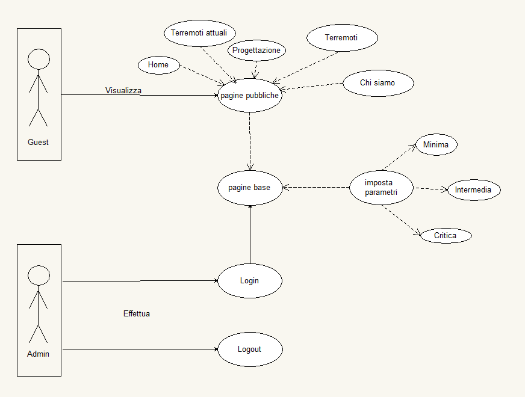

### Pianificazione

- Gantt preventivo:


## Progettazione

### Design dell’architettura del sistema

- Fishino:


<br>
La scheda FishinoUNO è la prima scheda di fishino, compatibile al 100% con Arduino UNO ma con molti componenti aggiuntivi che aumentano le potenzialità di questa scheda. I componenti aggiuntivi sono:
  - Modulo WIFI : utile alla connessione della scheda a una rete wifi
  - Slot MicroSD: permette alla scheda fishino di utilizzare grandi quantità di dati
  - Modulo RTC : permette alla scheda di conoscere in tempo reale anche senza alimentazione, (funziona a batteria), l'ora esatta
  - Alimentazione 3.3V potenziata
  - È compatibile con le schede millefori

Sitemap:


### Schema E-R, schema logico e descrizione

L'immagine sottostante rappresenta il diagramma E/R del database SismoLive:

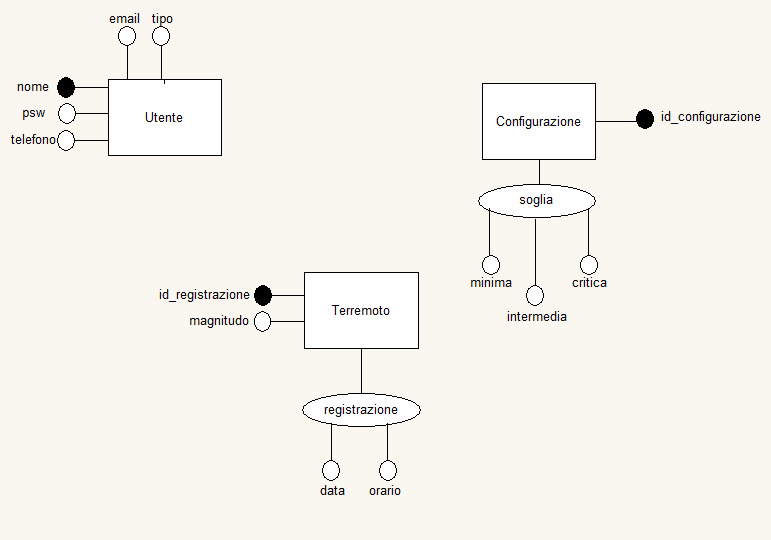

### Design delle interfacce

Progettazione pagina principale, abbiamo inizialmente pensato di avere una home che contenesse la visualizzazione dei dati in live sotto forma di grafico e tabella:

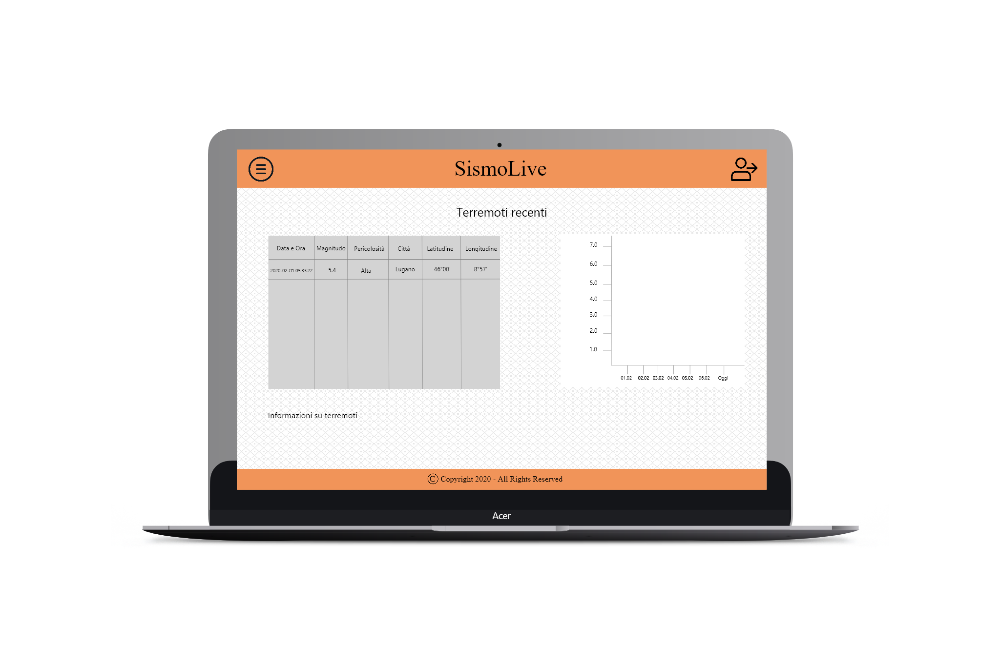

Progettazione pagina login, abbiamo pensato di avere una pagina di login dove gli amministratori possono accedere tramite le credenziali nome utente e password:

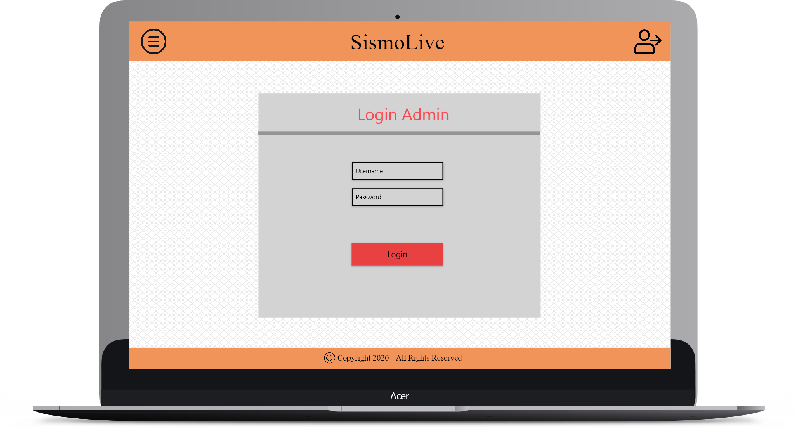

Progettazione terremoti, pagina dove vengono mostrate due tabelle con i terremoti più percepiti in Svizzera e nel mondo con colonne: data, magnitudo, pericolosità e la città:

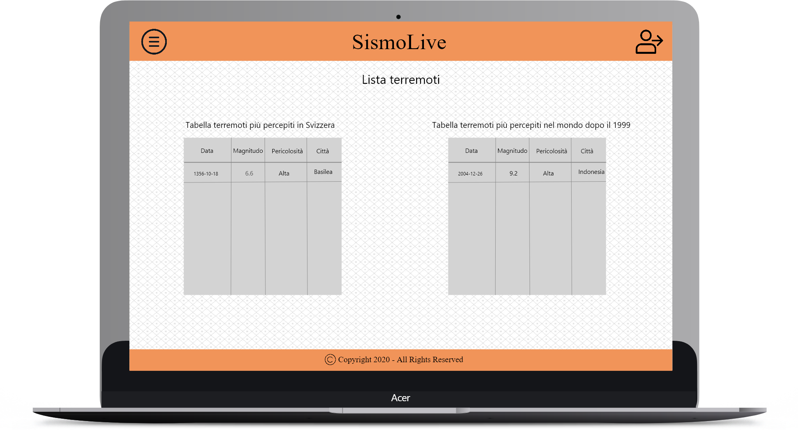

Progettazione Menu a tendina, abbiamo progettato di fare un menu a tendina dove si potesse navigare fra le varie pagine(Home, terremoti, progettazione, chi siamo):


Progettazione pagina progettazione, abbiamo pensato di fare una pagina dove viene spiegato il progetto, con dei commenti, un analisi e lo sviluppo e sulla destra un'immagine del montaggio:


### Design procedurale

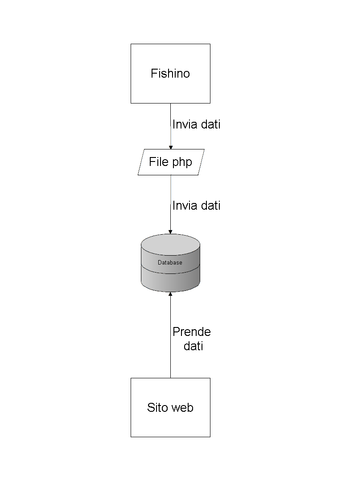

## Implementazione

### Sito

- [js](../Source/Sito/js/)

> Cartella nella quale sono salvati tutti i file javascript.

- [fonts](../Source/Sito/fonts/)

> Cartella nella quale sono salvati tutti i font.

- [csv](../Source/Sito/csv/)

> Cartella nella quale sono salvati tutti i file in formato csv.

- [css](../Source/Sito/css/)

> Cartella nella quale sono salvati tutti i file di stile css.

- [php](../Source/Sito/php/)

> Cartella nella quale sono salvati tutti i file PHP.

- [img](../Source/Sito/img/)

> Cartella nella quale sono salvate tutte le immagini.

- [html](../Source/Sito/html/)

> Cartella nella quale sono salvati tutti i file html-php.

- [vendor](../Source/Sito/vendor/)

> Cartella nella quale sono tutti i vendor utili per il sito.

#### config.php

In questo file sono definite le costanti per l'accesso al database da remoto.

```php
//IP del database
define('DB_SERVER', '160.153.133.208');
// Utente del database
define('DB_USERNAME', 'sismo');
// Password dell'utente
define('DB_PASSWORD', 'simo');
// Database a quale accedere
define('DB_NAME', 'SismoLive');
```

#### connectToDB.php

Tenta di connettersi al database con le credenziali prese dal file **config.php**,
ma se la connessione fallisce stampa un errore.

```php
// Include il file da dove prendere le varie variabili
include "config.php";
// Tentativo di connessione al database
$link = mysqli_connect(DB_SERVER, DB_USERNAME, DB_PASSWORD, DB_NAME);
// Controlla la connessione se è andata a buon fine
if ($link === false) {
    die("ERROR: Could not connect. " . mysqli_connect_error());
}
```

#### login.php

Quando una persona prova ad accedere al sito, la password inserita nel login viene criptata con l'hash md5,
se essa equivale alla password trovata nel database, esegue l'accesso.
Sennò verrà stampato un errore cons critto "Password errata!".
Ovviamente però, per fare questo controllo l'username inserito deve esistere.

```php
if (md5($password) == $pass) {
    // La password è corretta e quindi inizia la sessione
    session_start();
    // Salva i dati nelle variabili di sessione
    $_SESSION["loggedin"] = true;
    $_SESSION["username"] = $username;
    $_SESSION["error"] = "";
    $_SESSION["errorLogin"] = "";
    header("location: ../index.php");
} else {
    $_SESSION["errorLogin"] = "Password errata!";
    header("location: ../html/login.php");
}
```

#### logout.php

Esegue l'unset di tutte le variabili della sessione.
Distrugge la sessione e infine reindirizza l'utente alla pagina principale.

```php
// Inizializza la sessione
session_start();
// Esegue l'unset di tutte le variabili di sessione
$_SESSION = array();
// Distrugge la sessione
session_destroy();
// Reindirizza alla pagina principale
header("location: ../index.php");
exit;
```

#### table-earth.php

Innanzitutto apre file csv e Dopodiché legge il contenuto del file e lo inserisce
in una variabile.
Poi rimuove tutte tutti i ritorni a capo dalla variabile che contiene il contenuto del file.

```php
// Apre il csv di riferimento
$f = fopen("../csv/mondo.csv", "r");
// Legge il contenuto del file
$fr = fread($f, filesize("../csv/mondo.csv"));
// Chiude il file
fclose($f);
//Rimuove tutti i ritorni a capo
$lines = explode("\n\r", $fr);
```

Con il ciclo for, passerà tutte le righe del file csv.
Se è alla prima riga, crea l'header della tabella, sennò legge la riga attuale e
immette i dati nella tabella.

```php
$check = 0;
for ($i = 0;$i < count($lines);$i++) {
  // Se è nella prima riga, crea l'header della tabella
    if ($check == 0) {
        echo "<thead class='thead-dark'>";
        echo "<tr>";
        $cells = array();
        // Toglie ; da tutti i dati
        $cells = explode(";", $lines[$i]);
        for ($k = 0;$k < count($cells);$k++) {
            echo "<th scope='col'>" . $cells[$k] . "</th>";
        }
        echo "</tr>";
        echo "</thead>";
        echo "</tbody>";
    } else {
        echo "<tr>";
        $cells = array();
          // Toglie ; da tutti i dati
        $cells = explode(";", $lines[$i]);
        for ($k = 0;$k < count($cells);$k++) {
            echo "<td>" . $cells[$k] . "</td>";
        }
        echo "</tr>";
    }
    $check++;
}
```

#### CSV

Esempio del formato in csv, ogni campo è separato da un ";".

```csv
Data;Magnitudo;Pericolosità;Città

1960.05.22;9.5;Molto alta;Valdivia, Cile

1964.03.27;9.2;Molto alta;Stretto di Prince William, Alaska (Stati Uniti)

2004.12.26;9.1;Molto alta;Oceano Indiano, Sumatra, Indonesia

2011.03.11;9.0;Molto alta;Oceano Pacifico, Regione di Tohoku, Giappone

1952.11.04;9.0;Molto alta;Kamcatka, Russia (all'epoca in URSS)

1868.08.13;9.0;Molto alta;Arica, Cile

1700.01.26;8.7;Molto alta;Oceano Pacifico, USA e Canada

1869.07.09;8.9;Molto alta;Oceano Pacifico, Regione di Tohoku, Giappone

1611.12.02;8.9;Molto alta;Oceano Pacifico, Hokkaido, Giappone

1762.04.02;8.8;Molto alta;Chittagong, Bangladesh
```

#### logged.php

Se l'utente ha effettuato il login, mostrerà il bottone per accedere
alla pagina dei parametri oppure per disconnettersi dal sito.
Se invece non ha effettuato il login, mostrerà solamente il bottone per accedere.

```php
$login = "http://sismolive.online/html/login.html";
$logout = "http://sismolive.online/php/logout.php";
$parametri = "http://sismolive.online/html/configurazione.php";
// Se l'utente è loggato mostrerà il tasto di logout e per accedere alla configurazione dei parametri, sennò comparirà solamente il tasto per effettuare il login.
if (!isset($_SESSION["loggedin"]) || $_SESSION["loggedin"] !== true) {
    // Mostra il bottone per il login
    echo "<li class='get-started'><a href='$login'>Login</a></li>";
} else {
    // Mostra il bottone per la disconnessione dal sito oppure per accedere alla pagina dei parametri
    echo "<li class='get-started'><a href='$parametri'>Parametri</a></li>";
    echo "<li class='get-started'><a href='$logout'>Logout</a></li>";
}
```

#### getSoglie.php

Necessita del file **connectToDB.php** per effettuare la connessione al database.
Esegue una query e se nel risultato generato c'è almeno una riga, esegue un ciclo while
settando le variabili **$soglia_minima**, **$soglia_intermedia** e **$soglia_critica**.

```php
// Include il file che effettua la connessione al database
include "connectToDB.php";
$soglia_minima = '';
$soglia_critica = '';
$soglia_intermedia = '';
// Query
$soglie = "SELECT soglia_minima, soglia_intermedia, soglia_critica FROM Configurazione";
$result = $link->query($soglie);
if ($result->num_rows > 0) {
    while ($row = $result->fetch_assoc()) {
        $soglia_minima = $row['soglia_minima'];
        $soglia_intermedia = $row['soglia_intermedia'];
        $soglia_critica = $row['soglia_critica'];
    }
}
```

#### mail.php

In questa funzione bisogna passare il destinatario, il mittente, il nome del mittente,
l'oggetto e il messaggio della mail.

```php
function smtpmailer($to, $from, $from_name, $subject, $body) {
    $mail = new PHPMailer();
    $mail->IsSMTP();
    $mail->SMTPAuth = true;
    $mail->SMTPSecure = 'ssl';
    $mail->Host = 'n3plcpnl0298.prod.ams3.secureserver.net';
    $mail->Port = 465;
    $mail->Username = 'terremoto@sismolive.online';
    $mail->Password = 'terremoto';
    $mail->IsHTML(true);
    //Indirizzo mail mittente
    $mail->From = "terremoto@sismolive.online";
    //Nome mittente
    $mail->FromName = $from_name;
    $mail->Sender = $from;
    $mail->AddReplyTo($from, $from_name);
    //Oggetto della mail
    $mail->Subject = $subject;
    //Contenuto della mail
    $mail->Body = $body;
    //Destinatario
    $mail->AddAddress($to);
    //Invio la mail
    $mail->Send();
}
```

Necessita del file **connectToDB.php** per effettuare la connessione al database e del file **PHPMailerAutoload.php** per l'invio delle mail.
Esegue una query che legge l'indirizzo email di ogni amministratore e per ogni di esso, invia la mail.

```php
session_start();

require "mail/PHPMailer/PHPMailerAutoload.php";
require "connectToDB.php";

$from = 'terremoto@sismolive.online';
$name = 'SismoLive';
$subj = 'Allarme terremoto!';
$msg = 'In data ' . $_SESSION['data'] . ' abbiamo rilevato un terremoto di magnitudo ' . $_SESSION['magnitudo'] . ' alle ' . $_SESSION['orario'];
$email = "SELECT email FROM Utente";
$result = $link->query($email);
if ($result->num_rows > 0) {
    while ($row = $result->fetch_assoc()) {
        $to = $row['email'];
        $error = smtpmailer($to, $from, $name, $subj, $msg);
    }
}
```

#### MySQL_connection.php

Necessita del file **connectToDB.php** per effettuare la connessione al database.
Effettua due query nel database, da esse estrae l'ultimo **id** e le tre configurazioni delle soglie.
Dopodiché legge il dato mandato dal fishino e inserisce il record nella tabella se la magnitudo è sopra o uguale alla soglia minima.
Se la magnitudo è sopra o uguale alla soglia intermedia, manda una mail a tutti gli amministratori.
Invece, se la magnitudo è sopra o uguale alla soglia critica, manda un sms.

```php
session_start();
// Include il file che effettua la connessione al database
include "connectToDB.php";
// Stringhe rappreentanti le query
$soglie = "SELECT soglia_minima, soglia_intermedia, soglia_critica FROM Configurazione";
$terremoti = "SELECT * FROM Terremoto";
// Esecuzione delle query
$querySoglie = $link->query($soglie);
$queryTerremoti = $link->query($terremoti);
// Estrae l'ultimo id_registrazione
$id_reg = $queryTerremoti->num_rows + 1;
// Estrae le tre configurazioni delle soglie
$configurazioni = $querySoglie->fetch_assoc();
$sogliaMinima = $configurazioni["soglia_minima"];
$sogliaIntermedia = $configurazioni["soglia_intermedia"];
$sogliaCritica = $configurazioni["soglia_critica"];
// Imposta il fuso orario corretto
date_default_timezone_set("Europe/Zurich");
// Data e ora attuali
$data_corrente = date("Y-m-d");
$ora_corrente = date("H:i:s");
// leggo il dato mandato dal fishino
//$magnitudo = round($_POST['value'], 1);

// Magnitudo random
$magnitudo = rand(1,10);

//Inserisce il record nella tabella se la magnitudo è sopra o uguale alla soglia minima
if ($magnitudo >= $sogliaMinima) {
    $inserimentoDati = "INSERT INTO Terremoto(id_registrazione,magnitudo,data_registrazione,orario_registrazione) VALUES ('$id_reg','$magnitudo','$data_corrente','$ora_corrente')";
    if ($link->query($inserimentoDati) === TRUE) {
        echo "Inserimento dati riuscito";
    } else {
        echo "Error: " . $inserimentoDati . "<br>" . $link->error;
    }
}
// Manda la mail se la magnitudo è sopra o uguale alla soglia intermedia
if ($magnitudo >= $sogliaIntermedia) {
    $_SESSION['magnitudo'] = $magnitudo;
    $_SESSION['orario'] = $ora_corrente;
    $_SESSION['data'] = $data_corrente;
    require "mail.php";
}
// Manda un sms se la magnitudo è sopra o uguale alla soglia critica
if ($magnitudo >= $sogliaCritica) {
    require "sms/sms.php";
}
```

#### data.php

Necessita del file **connectToDB.php** per effettuare la connessione al database.
Esegue una query e se nel risultato generato c'è almeno una riga, esegue un ciclo while
settando le variabili **$orario** e **$magnitudo**.
Infine, esegue un trim togliendo le virgole da entrambe le variabili.

```php
// Include il file che effettua la connessione al database
include "../php/connectToDB.php";

$orario = '';
$magnitudo = '';
$terremoti = "SELECT * from tabella";
$result = $link->query($terremoti);
if ($result->num_rows > 0)
{
    while ($row = $result->fetch_assoc())
    {
        $orario = $orario . '"' . $row['orario_registrazione'] . '",';
        $magnitudo = $magnitudo . '"' . $row['magnitudo'] . '",';
    }
}

$orario = trim($orario, ",");
$magnitudo = trim($magnitudo, ",");
```

Questo pezzo di codice mostra come viene fatta la tabella con i dati del presi dal database, viene effettuata una query dove seleziona tutti i dati della tabella ma con un limite di dati che possono essere mostrati (definito in una funzione del database), in modo che la tabella non è così grande.
Se la query ritorna correttamente e ci sono dei dati all'interno della tabella, allora inserisce nella tabella i valori corrispondenti della data, ora e magnitudo.

```php
$terremoti = "SELECT * from tabella";
$result = $link->query($terremoti);
if ($result->num_rows > 0)
{
  while ($row = $result->fetch_assoc())
  {
    echo "<tr><th>" . $row["data_registrazione"] . "</th><th>" . $row["orario_registrazione"] . "</th><th>" . $row["magnitudo"] . "</tr>";
  }
}

```

#### sms.php

Invia il messaggio solo a un destinatario per il momento.
Il contenuto del messaggio sarà "Allarme terremoto!".

```php
require_once ('messagebird/vendor/autoload.php');
// Chiave API
$MessageBird = new \MessageBird\Client('5ObfVA3rDJcJhRR5DgUz8XIIW');
$Message = new \MessageBird\Objects\Message();
//Nome del mittente
$Message->originator = 'SismoLive';
//Numero del destinatario
$Message->recipients = ['+41789246797'];
//Messaggio da mandare
$Message->body = 'Abbiamo rilevato un terremoto critico, mettiti al riparo velocemente!';
//Invia il messaggio
try {
    $MessageResult = $MessageBird->messages->create($Message);
}
catch(\MessageBird\Exceptions\AuthenticateException $e) {
    // Significa che la chiavi API è sbagliata
    echo 'Chiave API errata';
}
catch(\MessageBird\Exceptions\BalanceException $e) {
    // Significa che il credito è finito
    echo 'Credito finito';
}
catch(\Exception $e) {
    echo $e->getMessage();
}

```

#### Ricarica pagina

Ogni 1000 millisecondi, ovvero ogni secondo fa la query per vedere se ci sono terremoto nuovi.
Questo rende sia il grafico sia la tabella in modalità "real-time".

```javascript
$('#responsecontainer').load('data.php');
var refreshId = setInterval(function() {
    $('#responsecontainer').load('data.php');
}, 1000);
```

#### Ordinare tabella

Permette di ordinare le tabelle per data, orario e magnitudo.

```javascript
const getCellValue = (tr, idx) => tr.children[idx].innerText || tr.children[idx].textContent;
const comparer = (idx, asc) => (a, b) => ((v1, v2) => v1 !== '' && v2 !== '' && !isNaN(v1) && !isNaN(v2) ? v1 - v2 : v1.toString().localeCompare(v2))(getCellValue(asc ? a : b, idx), getCellValue(asc ? b : a, idx));

// Per ogni table header, aggiunge un evento di click
// Se l'utente clicca su un table header, viene ordinata la tabella.
document.querySelectorAll('th').forEach(th => th.addEventListener('click', (() => {
    const table = th.closest('table');
    const tbody = table.querySelector('tbody');
    Array.from(tbody.querySelectorAll('tr')).sort(comparer(Array.from(th.parentNode.children).indexOf(th), this.asc = !this.asc)).forEach(tr => tbody.appendChild(tr));
})));
```

#### Header

Esempio di header per ogni pagina, nell'ultima voce viene chiamato in causa il file che decide
se mostrare il bottone di login oppure i bottoni per effettuare il logout o settare le soglie.

```html
<nav class="nav-menu d-none d-lg-block">
  <ul>
    <li class="active"><a href="#header">Home</a></li>
    <li ><a href="html/terremoti_attuali.php">Terremoti Attuali</a></li>
    <li><a href="html/terremoti.php">Terremoti</a></li>
    <li><a href="html/progettazione.php">Progettazione</a></li>
    <li><a href="html/chisiamo.php">Chi siamo</a></li>
    <?php require_once "php/logged.php";?>
  </ul>
</nav>
```

### Database

#### Creazione database
Elimina il database se esiste, dopodiché lo crea e viene selezionato.

```sql
drop database if exists SismoLive;
create database SismoLive;
use SismoLive;
```
#### Creazione tabelle

Tabella per gli utenti del sito, ogni admin ha un nome, una password,
una mail, un numero di telefono e il tipo di utente (admin o utente normale).

```sql
drop table if exists Utente;
create table Utente(
	nome varchar(20) primary key not null,
	psw varchar(100) not null,
	email varchar(50) not null,
	telefono long not null,
	tipo varchar(20) not null
);
```

Tabella per la configurazione del sensore, ha tre soglie.
La prima, quando viene superata registra il valore nella tabella terremoto.
La seconda, quando viene superata manda una mail a tutti gli amministratori del sito.
L'ultima invece, quando viene superata manda un sms.

```sql
drop table if exists Configurazione;
create table Configurazione(
	id int primary key auto_increment,
	soglia_minima double not null, #Soglia per registrare il valore nella tabella Terremoto
    soglia_intermedia double not null, # Soglia per mandare la mail
    soglia_critica double not null # Soglia per mandare l'SMS'
);
```

Tabella per salvare i terremoti registrati, ogni di esso ha un magnitudo, l'orario
in cui è stato registrato e anche la data.

```sql
drop table if exists Terremoto;
create table Terremoto(
	id_registrazione int primary key not null,
    magnitudo double not null,
	data_registrazione DATE not null,
    orario_registrazione TIME not null
);
```

#### Amministratori

Inserisce nel database i 5 admin predefiniti, tra cui uno è di test.

```sql
insert into Utente(nome,psw,email,telefono,tipo) values ("Georgiy",md5("PasswordDiGeorgiy"),"georgiy.farina@samtrevano.ch",41790123456,"A");
insert into Utente(nome,psw,email,telefono,tipo) values ("Marco",md5("PasswordDiMarco"),"marco.lorusso@samtrevano.ch",41791234567,"A");
insert into Utente(nome,psw,email,telefono,tipo) values ("Matthias",md5("PasswordDiMatthias"),"matthias.iannarella@samtrevano.ch", 41789246797,"A");
insert into Utente(nome,psw,email,telefono,tipo) values ("Daniel",md5("PasswordDiDaniel"),"daniel.matt@samtrevano.ch",41793456789,"A");
insert into Utente(nome,psw,email,telefono,tipo) values ("test",md5("test"),"thias.ianna@gmail.com",41793456789,"A");
```

#### Amministratori

Inserisce nel database la soglia_minima, soglia_intermedia e soglia_critica.

```sql
insert into Configurazione(soglia_minima,soglia_intermedia,soglia_critica) values(3.0,6.0,7.5);
```

#### Funzioni

DA COMMENTARE

```sql
DELIMITER //
CREATE FUNCTION getStartId()
returns int deterministic
BEGIN
	declare startId int;
	set startId = (select max(id_registrazione) -7 from Terremoto);
    if startId < 0 then
		set startId = 0;
    end if;
    return startId;
END
//
DELIMITER ;
```

DA COMMENTARE

```sql
DELIMITER //
CREATE FUNCTION getFinishId()
returns int deterministic
BEGIN
	declare finishId int;
	set finishId = (select max(id_registrazione) from Terremoto);
    return finishId;
END
//
DELIMITER ;
```

#### View

Crea una view che prende solamente gli ultimi **7** terremoti inseriti nel database, di essi prende la data di registrazione, l'orario di registrazione e la magnitudo del terremoto.

```sql
drop view if exists tabella;
create view tabella as select t.data_registrazione, t.orario_registrazione, t.magnitudo, t.id_registrazione from Terremoto t where t.id_registrazione > getStartId();
```

### Hardware e codice
<div style="text-align: justify">
La progettazione dell'hardware prevedeva l'uso di una board ArduinoWifi collegato al geofono e a un display per mostrare la misurazione ottenuta direttamente sul luogo. Purtroppo noi abbiamo avuto un problema con l'ordine dei componenti che sono risultati dispersi. Quindi abbiamo deciso di sviluppare il progetto con un fishino UNO Rev2, una scheda compatibile con arduino e equipaggiata con un modulo per il WIFI. Per quanto riguarda i dati di misurazione, generiamo noi dei dati fittizi da inviare al server.
</div>

<div style="text-align: justify">
Abbiamo utilizzato ArduinoIDE. Se si ha problemi con le librerie di fishino consultare il diario del

[3.04.2020](../Diari/SismoLive_2020_04_03.md)
o il sito di <a href="https://fishino.it/download-libraries-it.html">fishino</a>.<br>
Per prima cosa si deve configurare le informazioni che ci serviranno per connetterci al wifi come:
<ul>
    <li>SSID: nome della rete</li>
    <li>Password: password del wifi</li>
    <li>IP gateway</li>
    <li>Subnetmask</li>
</ul>
L'IP del fishino verrà assegnato automaticamente dal DHCP del router, ma se si vuole si puo assegnare un IP fisso con la seguente riga di codice "#define IPADDR 192, 168, 1, 251". Quindi per fare questa configurazione bisognerà scrivere il seguente codice:<br>
<br>


<br>
Dopo aver adattato lo sketch alla rete si deve poter connettere la scheda al WIFI appena configurato.
Il primo passo per connettere il fishino a una nuova rete è quello di resettarlo in modo da cancellare vecchie configurazioni sulla scheda.
<br>


<br>
Dopodiché si imposta la modalità fisica a 11G e la modalità di operazione del fishino in <b>STATION_MODE</b>, così facendo si impone al fishino di dover collegarsi a una rete wifi già esistente. Infatti il fishino è in grado di creare un nuova rete con la modalità <b>SOFTAP_MODE</b>
<br>


<br>

Ora si può passare alla connessione al wifi. Con la soluzione da noi proposta se la rete non esiste o se si ha passato una password errata il programma continuerà a provare a connettersi all'infino finché non trova la rete con SSID e Password passati prima. Quindi il codice è il seguente:
<br>

<br>

Infine, manca solo l'acquisizione di un indirizzo IP dal DHCP. Per fare questo esiste il metodo <b>Fishino.staStartDHCP()</b>. Anche qui il programma aspetta all'infinito finché il fishino non ha ricevuto un IP dal DHCP.
<br>

<br>

Adesso il fishino è connesso al wifi e manca solo di inviare i dati al nostro server.
<br>
Fishino invia i dati con il metodo POST, ma per prima cosa ci si deve connettere al host dove è presente il file php in cui andremo a ricevere i dati che invia il fishino. Il metodo che permette la connessione al host del server è <b>client.connect("www.sismolive.online",80)</b>, dove il primo parametro corrisponde all'host mentre il secondo è la porta su cui vogliamo connetterci.
Se la connessione all'host va a buon fine possiamo impostare il file che dovrà ricevere i dati, questo lo si fa con il meotodo <b>client.println(F("POST /Php/MySQL_connection.php HTTP/1.1"));</b>. Il percorso che si deve inserire è il percorso del file php partendo dall'host.
Poi bisogna riferire la lunghezza del dato che si vuole mandare, questo lo si può ricavare con il metodo <b>length()</b>. Il metodo di invio dati alla fine risulterà questo:
<br>
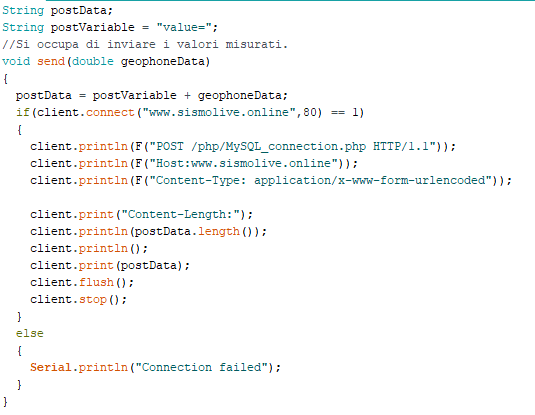
<br>
Il parametro passato non è altro che il valore che abbiamo creato il generatore di dati fittizi. Il generatore di dati è un normalissimo random di numeri double in un range specificato con numero minimo e massimo (inclusi nella randomizzazione).
<br>

<br>
</div>

## Test

### Protocollo di test

***DA COMPLETARE***


|Test Case      | TC-001                       |
|---------------|--------------------------------------|
|**Nome**       |Presenza del sito|
|**Riferimento**|REQ-001|
|**Descrizione**| Bisogna verificare che esista il sito all'url: http://sismolive.online/index.php, e che tutte le pagine vengono visualizzate senza problemi.|
|**Prerequisiti**| --- |
|**Procedura**   | Aprire un browser ed andare sul seguente url: http://sismolive.online/index.php, controllare che il grafico e la tabella si vedono e si aggiornano ogni 5 secondi, aprire anche le altre sezioni del sito.|
|**Risultati attesi** | Deve apparire la pagina principale con grafico e tabella con dati al suo interno, ogni 5 secondi si deve poter vedere un miglioramento, non ci devono essere problemi di connessione al database o di altro genere.|


|Test Case      | TC-002                       |
|---------------|--------------------------------------|
|**Nome**       | Presenza di una pagina di login|
|**Riferimento**|REQ-003|
|**Descrizione**| Visitando il sito, deve esserci la possibilità di eseguire il login e collegarsi come amministratori.|
|**Prerequisiti**| Visitare il sito|
|**Procedura**   | Avere il sito su questo url: http://www.sismolive.online/index.php Dopodiché in alto a destra cliccare sul bottone "Login" inserire le credenziali: nome utente: test password: test. E controllare se una volta reindirizzato sulla pagina principale, spunta la parte di configurazione. |
|**Risultati attesi** | Dovrebbe apparire la pagina di login, e tramite le credenziali deve poter accedere come amministratore e avere la possibilità di aprire la pagina di configurazione e modificare i parametri.|


|Test Case      | TC-003                       |
|---------------|--------------------------------------|
|**Nome**       |Compatibilità coi principali browser|
|**Riferimento**|REQ-007|
|**Descrizione**| Il sito deve essere compatibile con i principali browser (Chrome, Opera, Firefox, Edge)|
|**Prerequisiti**| Avere il sito |
|**Procedura**   | Inserire l'url http://www.sismolive.online/index.php sui vari browser sopracitati, controllare se i grafici e la tabella si aggiornano ogni 5 secondi e che il login funzioni.|
|**Risultati attesi** | Dovrebbe apparire la pagina principale con i grafici e le tabelle e con possibilità di effettuare il login.|


|Test Case      | TC-004                       |
|---------------|--------------------------------------|
|**Nome**       | Presenza di un'agenda di progetto su TRELLO|
|**Riferimento**|REQ-015|
|**Descrizione**| Dev'esserci un'agenda di progetto su TRELLO |
|**Prerequisiti**| Tutti e 4 i componenti del gruppo e il docente perito del progetto devono avere un account|
|**Procedura**   | Visitare https://trello.com/b/fdVY0YLT/sismolive|
|**Risultati attesi** | Visitando l'agenda devono essere presenti le varie liste di attività|


|Test Case      | TC-005                       |
|---------------|--------------------------------------|
|**Nome**       |DB collegato al sito|
|**Riferimento**|REQ-002, REQ-009|
|**Descrizione**|Deve esistere un database collegato da remoto al sito|
|**Prerequisiti**||
|**Procedura**   |Connettersi al DB tramite WorkBench, provare ad aggiungere un record in Terremoto, in seguito aprire il sito e controllare se nella tabella e nel grafico viene visualizzato il record.|
|**Risultati attesi** |Sul sito dovrebbe apparire il nuovo record di terremoto, sia nella tabella che nel rispettivo grafico.|


|Test Case      | TC-006                       |
|---------------|--------------------------------------|
|**Nome**       |Grafici sul sito          |
|**Riferimento**|REQ-008|
|**Descrizione**|I dati sul sito devono essere rappresentati sotto forma di grafici.  |
|**Prerequisiti**|Avere dei dati da dover rappresentare.|
|**Procedura**   |Visitare http://www.sismolive.online/index.php e scorrere in basso, fino al grafico, dove ogni 5 secondi si deve aggiornare.|
|**Risultati attesi** |Si dovrebbe poter vedere il grafico dei terremoti che si aggiorna ogni 5 secondi, con accanto la rispettiva tabella|


|Test Case      | TC-007                       |
|---------------|--------------------------------------|
|**Nome**       |Struttura hardware con Arduino|
|**Riferimento**|REQ-004                     |
|**Descrizione**|La creazione dei dati deve avvenire da una struttura hardware con Arduino.  |
|**Prerequisiti**|  |
|**Procedura**   |Controllare la struttura dell'Arduino. |
|**Risultati attesi** |Deve esserci una struttura solida con Arduino.  |


|Test Case      | TC-008                       |
|---------------|--------------------------------------|
|**Nome**       |Misurazione vibrazioni con geofono           |
|**Riferimento**|REQ-005                     |
|**Descrizione**|Tramite il geofono, bisogna poter prendere i dati che elabora con le vibrazioni del terreno, e poterli leggere nell'arduino.  |
|**Prerequisiti**|                           |
|**Procedura**   |Controllare se c'è il geofono e se l'arduino tramite un sistema di output, riceve i dati dal componente correttamente. |
|**Risultati attesi** |L'arduino deve stampare in console i vari valori delle frequenze che elabora il geofono.|


|Test Case      | TC-009                       |
|---------------|--------------------------------------|
|**Nome**       |Collegamento Fishino al WIFi          |
|**Riferimento**|REQ-006                     |
|**Descrizione**|La parte hardware del progetto deve poter inviare dati tramite WIFI e quindi deve potersi collegare a internet.|
|**Prerequisiti**|  |
|**Procedura**   |Controllare che esista la rete con SSID e password definiti nel codice fishino.|
|**Risultati attesi** |La porta seriale a fine collegamento dovrebbe stampare lo stato della connessione.|


|Test Case      | TC-010                       |
|---------------|--------------------------------------|
|**Nome**       |Invio dati|
|**Riferimento**|REQ-006                  |
|**Descrizione**|L'invio dei dati avviene tramite il metodo post, verso un file php all'interno del sito internet. I dati inviati sono fittizi.|
|**Prerequisiti**|Riuscirsi a collegarsi a internet|
|**Procedura**   |Una volta collegati al wifi, il codice dovrebbe mandare i dati 5 volte al secondo tramite il metodo send.|
|**Risultati attesi** |Il fishino non da errori nell'invio di dati.|

|Test Case      | TC-011                      |
|---------------|--------------------------------------|
|**Nome**       |Inserimento nel DB dei dati|
|**Riferimento**|REQ-009                    |
|**Descrizione**|I dati ricevuti dal fishino devono essere inseriti in un db mysql.|
|**Prerequisiti**|Avere un sito funzionante e un DB per contenere i dati.|
|**Procedura**   |Controllare che il fishino sia connesso, verificare che il sito e il DB esistano, verificare nel codice arduino che il percorso per il file php sia corretto.|
|**Risultati attesi** |Nel DB dovrebbero essere stati inseriti i dati|

|Test Case      | TC-012                      |
|---------------|--------------------------------------|
|**Nome**       | Dato in live su LCD|
|**Riferimento**|REQ-010                       |
|**Descrizione**| Tramite un LCD montato sull'arduino, bisogna mostrare il dato appena registrato|
|**Prerequisiti**||
|**Procedura**   |Controllare sulla struttura se c'è un LCD montato e se mostra i dati in tempo reale. |
|**Risultati attesi** |Ci dovrebbe essere un LCD con i dati misurati/generati casualmente. |

|Test Case      | TC-013                      |
|---------------|--------------------------------------|
|**Nome**       |configurazione soglie da parte dell'admin |
|**Riferimento**|REQ-11                       |
|**Descrizione**| Gli amministratori possono configurare delle soglie, che corrispondono alla soglia minima e a quella massima. Settando la soglia minima, si potranno vedere i dati riguardanti la magnitudo sopra ad esso. Settando la soglia critica ad un certo valore, se si registra un magnitudo sopra quel valore, gli admin vengono avvisati tramite un'email.|
|**Prerequisiti**||
|**Procedura**   |Entrare nel sito, fare il login con il nome utente: test e la password: test. Inseguito aprire la pagina di configurazione dei parametri e settare un valore minimo e uno massimo. Infine, controllare se sul grafico e sulla tabella escono solo i valori sopra la soglia e che se ci dovesse essere un terremoto di magnitudo sopra la soglia critica, arriva un'email. |
|**Risultati attesi** |La tabella e il grafico dovrebbero prendere in considerazione solo i dati sopra la soglia minima e si deve ricevere un'email se si supera la soglia critica. |

|Test Case      | TC-014                      |
|---------------|--------------------------------------|
|**Nome**       | Dato live sul sito|
|**Riferimento**|REQ-12                       |
|**Descrizione**|I dati che prende il sito, devono aggiornarsi in live sia sul grafico che sulla tabella, senza la necessità di riaggiornare la pagina ogni volta. |
|**Prerequisiti**||
|**Procedura**   |Aprire il sito, andare nella pagina dei terremoti attuali e aspettare fino a che il grafico e la tabella non cambia. |
|**Risultati attesi** |Il grafico e la tabella si aggiorna in live senza il refresh della pagina. |

|Test Case      | TC-015                      |
|---------------|--------------------------------------|
|**Nome**       |Notifica tramite email |
|**Riferimento**|REQ-13                       |
|**Descrizione**|Se si registra un terremoto sopra la soglia critica settata, gli amministratori ricevono un'email che si sta registrando un terremoto. |
|**Prerequisiti**||
|**Procedura**   |Aprire il sito, fare login con il nome utente: test e la password: test, settare una soglia critica, aspettare finché non si registra un valore alto, e inseguito controllare la casella postale. |
|**Risultati attesi** |Dovrebbe arrivare una mail, con un'allerta che si sta registrando un terremoto. |

|Test Case      | TC-016                      |
|---------------|--------------------------------------|
|**Nome**       |Notifica tramite messaggio |
|**Riferimento**|REQ-14                       |
|**Descrizione**|Se si registra un terremoto sopra la soglia critica settata, gli amministratori ricevono un messaggio sul telefono che si sta registrando un terremoto. |
|**Prerequisiti**||
|**Procedura**   |Aprire il sito, fare login con il nome utente: test e la password: test, settare una soglia critica, aspettare finché non si registra un valore alto, e inseguito controllare i messaggi sul telefono.  |
|**Risultati attesi** |Dovrebbe arrivare un messaggio con un'allerta che si sta registrando un terremoto. |

|Test Case      | TC-017                      |
|---------------|--------------------------------------|
|**Nome**       |Dati letti con frequenza settata |
|**Riferimento**|REQ-16                       |
|**Descrizione**| L'admin può settare il tempo in cui vengono letti i dati dal fishino.|
|**Prerequisiti**||
|**Procedura**   |Entrare nel sito, fare il login come amministratore e entrare nella pagina dei parametri, in seguito controllare se c'è un form dove si può inserire un numero che servirà alla modifica della frequenza dei dati letti. |
|**Risultati attesi** |Dovrebbe esserci un form e un bottone che confermi la frequenza, e il grafico e la tabella dovrebbero aggiornarsi in base al tempo appena settato. |


### Risultati test


| Test Case |  Stato  |
|-----------|---------|
|   TC-001  | Passato |
|   TC-002  | Passato |
|   TC-003  | Passato |
|   TC-004  | Passato |
|   TC-005  | Passato |
|   TC-006  | Passato |
|   TC-007  | Passato |
|   TC-008  | Non passato|
|   TC-009  | Passato |
|   TC-010  | Passato |
|   TC-011  | Passato |
|   TC-012  | Non passato |
|   TC-013  | Passato |
|   TC-014  | Passato  |
|   TC-015  | Passato |
|   TC-016  | Passato |
|   TC-017  | Non passato |

### Mancanze e limitazioni conosciute


##### Hardware


Il nostro progetto presenta la mancanza di un componente essenziale, ovvero il geofono per la misurazione delle vibrazioni terrestri.
Questo è dovuto dalla scomparsa del pacco con i componenti. Abbiamo "risolto" con la creazione di dati fittizi in un range tra 10.0 e 100.0 che viene in seguito diviso per 10, l'invio e la creazione dei dati avviene tramite un fishino UNO.

## Consuntivo

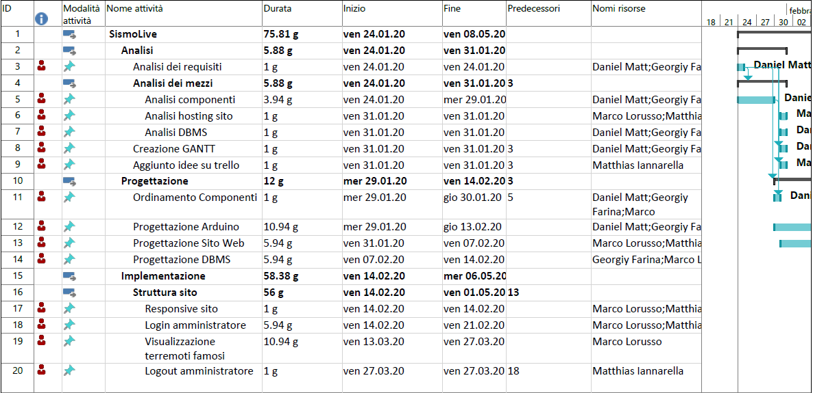
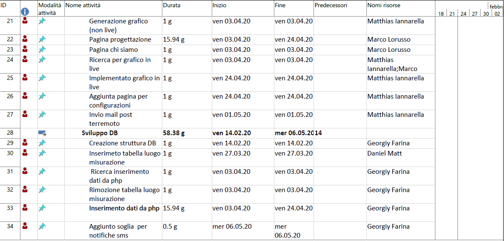

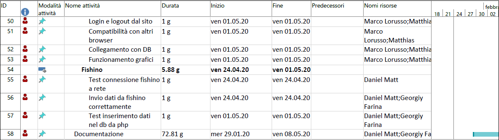
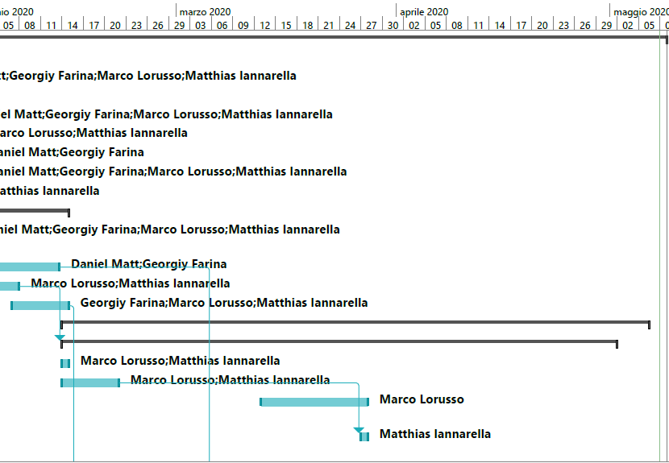
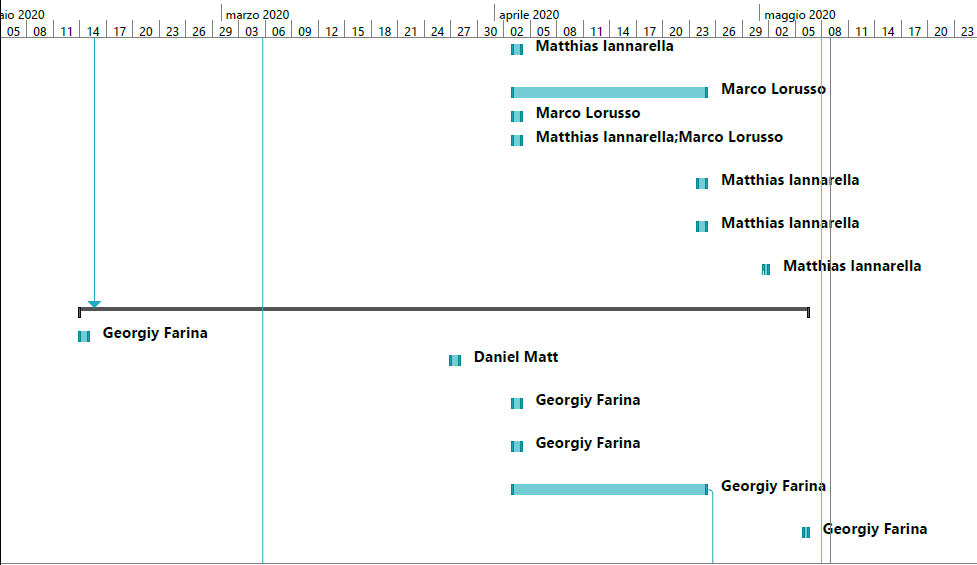
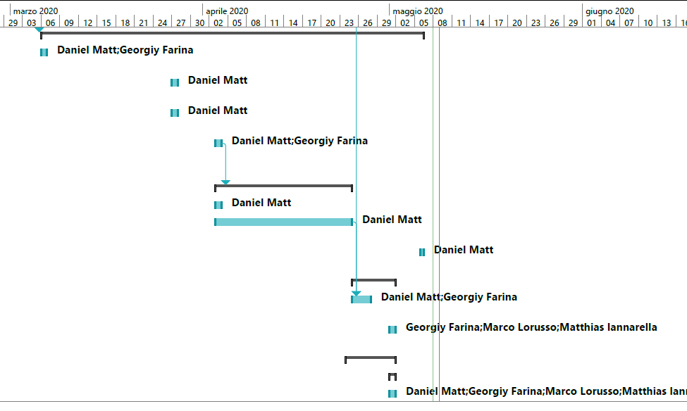
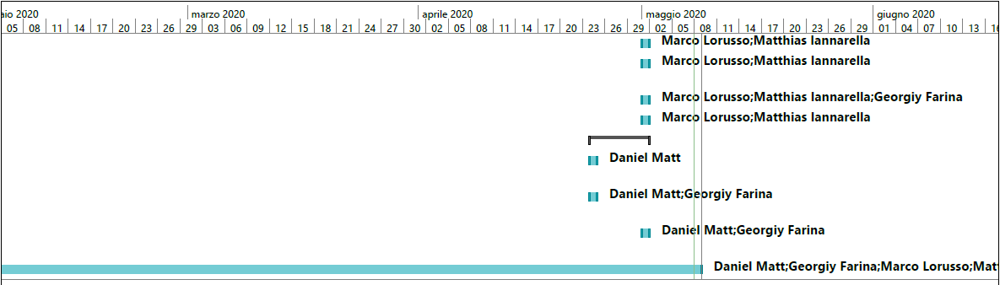

## Conclusioni

Marco:

Trovo che lavorare in team sia molto produttivo e che scaturiscono molte più idee, dividendosi i compiti e assegnando le parti dove uno è meno bravo ad un altro componente del gruppo si riesce a raggiungere obbiettivi molto elevati. In questo progetto abbiamo toccato molti punti dell'informatica, come la gestione e la programmazione dell'hardware, il database e infine il sito web. Se dovessimo riuscire a comprare il geofono penso che questo progetto si riveli molto importante e che potrà essere utile a molte persone.

Georgiy:

Da questo progetto ho iniziato a mettere in pratica il lavoro in team nell'ambito di progetti come questi. Mi è piaciuto lavorarci, anche perché siamo stati ben organizzati e ci siamo aiutati a vicenda quando si aveva bisogno.
Il lavoro non è stato assolutamente uno spreco né di tempo, né di risorse. Se implementato meglio, potrebbe rivelarsi abbastanza utile.

Matthias:

Rispetto al progetto individuale del primo semestre, in questo progetto a gruppi ho imparato a collaborare in team.
Il lavoro è stato motivante, ho avuto degli ottimi compagni di squadra e ci siamo trovati tutti quanti bene, senza complicazioni.
L'unica nota negativa che ho è che ad un certo punto eravamo un po' indietro col progetto, ma siamo riusciti a recuperare terreno ed a finirlo nel tempo limite.

Daniel:

Alla fine di questo progetto penso di aver compreso com'è realmente lavorare in team in un progetto importante. Ho capito l'importanza della comunicazione nel team.
Ho potuto rientrare nel mondo di fishino imparando a utilizzarlo. Il progetto è molto interessante, peccato che non abbiamo potuto implementare la parte con il geofono, che sicuramente avrebbe reso ancora più interessante questo progetto.

### Sviluppi futuri

  Date le problematiche e le circostanze che abbiamo avuto durante lo sviluppo del progetto,
  ci sarebbe da implementare un dispositivo per le effettive misurazioni delle vibrazioni, con una struttura solida che regga il tutto.
  Un altro sviluppo futuro potrebbe essere quello di inviare un sms a tutti gli amministratori del sito invece che a solo un numero di telefono, quando un terremoto supera la soglia critica, questo perché con un sms si è più raggiungibili poiché si può visualizzare senza internet a differenza delle email.

### Considerazioni personali

  Marco:

  In questo progetto ho migliorato le mie capacità di lavorare in team, le mie conoscenze nei vari linguaggi di programmazione(php, SQL, CSS, ...) e capito ancora meglio come unire parte hardware a database e database a sito web. Sono rimasto molto soddisfatto da questo progetto visti anche i grandi risultati.

  Georgiy:

  Ho compreso meglio le dinamiche di un lavoro in team, rendendomi conto di come ci si muove in progetti del genere. Ho consolidato le mie conoscenze dei vari linguaggi implementati quali SQL, PHP ecc..
  Sono rimasto più che soddisfatto da questo lavoro.

  Matthias:

  Grazie a questo progetto didattico, sono riuscito consolidare le mie conoscenze principalmente nel linguaggio PHP e HTML.
  Parlando del risultato, sono felice del risultato finale, mi aspettavo peggio.
  Spero che nei prossimi progetti, potrò mettere in pratica le conoscenze acquisite da questo progetto.

  Daniel:

  In questo progetto ho potuto migliorare la mia capacità di lavorare in team. Il nostro team si è dimostrato molto organizzato e collaborativo tri i suoi membri. Lavorare in gruppo secondo me è sicuramente più impegnativo, in fatto di organizzazione, che lavorare singolarmente.
  Questo progetto ha un grande potenziale, si possono effettuare ancora ulteriori modifiche e/o aggiunte in modo da migliorarne il funzionamento e le sue capacità.

## Sitografia

- https://www.sparkfun.com/, 29-01-2020
- https://www.seeedstudio.com/, 29-01-2020
- https://www.iconfinder.com/, 29-01-2020
- https://www.sparkfun.com/products/11744, 29-01-2020
- https://www.sparkfun.com/products/14074, 29-01-2020
- https://www.sparkfun.com/products/14030, 29-01-2020
- https://www.sparkfun.com/products/13678, 29-01-2020
- https://www.chartjs.org/, *Chart.js*, 27-03-2020
- https://www.arduino.cc/reference/en/language/functions/random-numbers/random/ , 27-03-2020
- https://stackoverflow.com/questions/14267781/sorting-html-table-with-javascript/49041392, *stackoverflow*, 03-04.2020
- https://www.w3schools.com/php/php_mysql_insert.asp, *w3schools*, 03-04.2020
- http://fishino.com/home-it.html, 03-04-2020
- https://www.fishino.com/files/fishino-theme/media/content-images/docs/libraries/FishinoLibrary-20180107.pdf 03-04-2020
- https://www.youtube.com/watch?v=32VcKyI0dio, 03-4-2020
- https://github.com/PHPMailer/PHPMailer, *PHPMailer*, 01-05-2020
- https://www.tutorialspoint.com/php/mysql_select_php.htm, 01-05-2020
- https://www.tutorialspoint.com/php/mysql_select_php.htm, 01-05-2020
- https://github.com/messagebird/php-rest-api, *messagebird*, 04-05-2020
- https://www.freeformatter.com/html-formatter.html, *HTML formatter*, 08-05-2020
- http://beautifytools.com/php-beautifier.php, *PHP formatter*, 08-05-2020


## Allegati

- [Diari di lavoro](../Diari/)

- [Codice sorgente](../../Source/)

- [Mandato](../Mandato/muggiasca_qdc_sismografo.pdf)

- Credenziali di accesso sul sito http://sismolive.online:
  - nome utente: test
  - password: test
