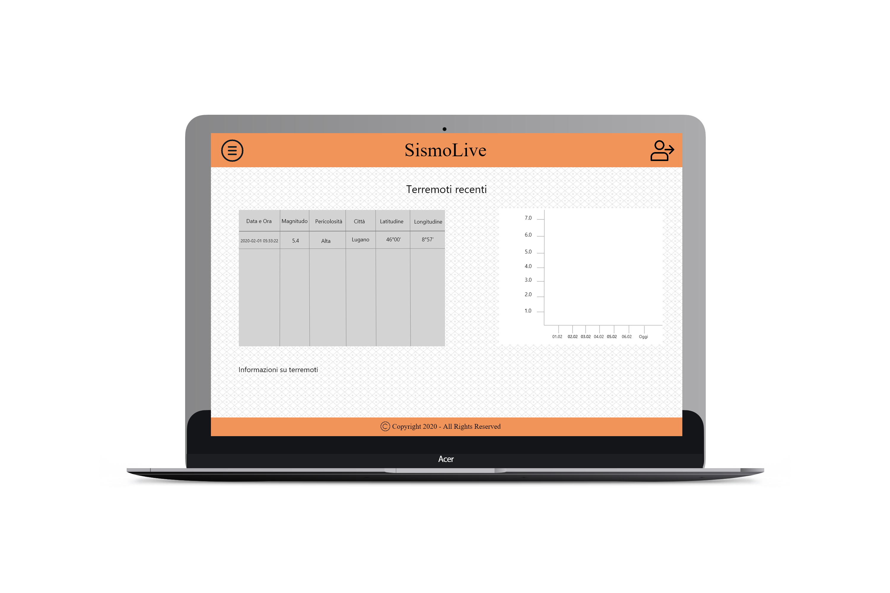

1. [Introduzione](#introduzione)

  - [Informazioni sul progetto](#informazioni-sul-progetto)

  - [Abstract](#abstract)

  - [Scopo](#scopo)

2. [Analisi](#analisi)

  - [Analisi del dominio](#analisi-del-dominio)

  - [Analisi dei mezzi](#analisi-dei-mezzi)

  - [Analisi e specifica dei requisiti](#analisi-e-specifica-dei-requisiti)

  - [Use case](#use-case)

  - [Pianificazione](#pianificazione)

3. [Progettazione](#progettazione)

  - [Design dell’architettura del sistema](#design-dell’architettura-del-sistema)

  - [Design dei dati e database](#design-dei-dati-e-database)

4. [Implementazione](#implementazione)

  - [Sito Internet](#Sito)

  - [Hardware e codice](#Hardware-e-codice)

  - [Database](#Database)

5. [Test](#test)

  - [Protocollo di test](#protocollo-di-test)

  - [Risultati test](#risultati-test)

  - [Mancanze/limitazioni conosciute](#mancanze/limitazioni-conosciute)

6. [Consuntivo](#consuntivo)

7. [Conclusioni](#conclusioni)

  - [Sviluppi futuri](#sviluppi-futuri)

  - [Considerazioni personali](#considerazioni-personali)

8. [Sitografia](#sitografia)

9. [Allegati](#allegati)

## Introduzione

### Informazioni sul progetto

- Allievi:
	> Daniel Matt (Sviluppatore)
	> Georgiy Farina (Sviluppatore)
	> Marco Lorusso (Sviluppatore)
	> Matthias Iannarella (Sviluppatore)

- Docenti: Luca Muggiasca (Cliente)

- Scuola: SAMT (Scuola d'arti e Mestieri Trevano)

- Sezione: Informatica

- Materia: Modulo 306 - Realizzare un piccolo proggetto IT

- Data inizio: 18 gennaio 2020

- Termine di consegna: 08 maggio 2020

### Abstract

  E’ una breve e accurata rappresentazione dei contenuti di un documento,
  senza notazioni critiche o valutazioni. Lo scopo di un abstract efficace
  dovrebbe essere quello di far conoscere all’utente il contenuto di base
  di un documento e metterlo nella condizione di decidere se risponde ai
  suoi interessi e se è opportuno il ricorso al documento originale.

  Può contenere alcuni o tutti gli elementi seguenti:

  -   **Background/Situazione iniziale**

  -   **Descrizione del problema e motivazione**: Che problema ho cercato
      di risolvere? Questa sezione dovrebbe includere l'importanza del
      vostro lavoro, la difficoltà dell'area e l'effetto che potrebbe
      avere se portato a termine con successo.

  -   **Approccio/Metodi**: Come ho ottenuto dei progressi? Come ho
      risolto il problema (tecniche…)? Quale è stata l’entità del mio
      lavoro? Che fattori importanti controllo, ignoro o misuro?

  -   **Risultati**: Quale è la risposta? Quali sono i risultati? Quanto è
      più veloce, più sicuro, più economico o in qualche altro aspetto
      migliore di altri prodotti/soluzioni?

  Esempio di abstract:

  > *As the size and complexity of today’s most modern computer chips
  > increase, new techniques must be developed to effectively design and
  > create Very Large Scale Integration chips quickly. For this project, a
  > new type of hardware compiler is created. This hardware compiler will
  > read a C++ program, and physically design a suitable microprocessor
  > intended for running that specific program. With this new and powerful
  > compiler, it is possible to design anything from a small adder, to a
  > microprocessor with millions of transistors. Designing new computer
  > chips, such as the Pentium 4, can require dozens of engineers and
  > months of time. With the help of this compiler, a single person could
  > design such a large-scale microprocessor in just weeks.*

### Scopo
  Lo scopo di questo progetto è quello di avere una costante misurazione, insieme alla relativa rappresentazione su un sito web, delle vibrazioni terrestri. Nel caso di un terremoto devono essere notificati gli admin via mail e gli utenti sul sito

## Analisi

### Analisi del dominio

Il prodotto finale potrà essere utilizzato da tutti gli utenti, sia esperti,
sia principianti, che hanno a disposizione un dispositivo in grado di navigare su internet. Chiunque può consultare il sito che conterrà una rappresentazione delle misurazioni delle scosse sismiche sotto forma di vari grafici. 
Attualmente esiste già un sito nazionale dedicato a questo tema, speriamo che la nostra versione sia più piacevole ed efficace.

### Analisi e specifica dei requisiti

**Spiegazione elementi tabella dei requisiti:**

***ID***: identificativo univoco del requisito.

***Nome***: breve descrizione del requisito.

***Priorità***: indica l’importanza di un requisito nell’insieme del
progetto (1 = massima, 2 = importante, 3 = Da considerare 4 = facoltativo).

***Versione***: indica la versione del requisito.

***Note***: eventuali note.

  | **ID**  | **Requisito** | **Priorità** | **Versione** | **Note** |
  | ------- | ------------- | ------------ | ------------ | -------- |
  | REQ-001 | Bisogna avere un sito per la visualizzazione di dati| 1 | 1.0  | http://lnstagram-it.com/SismoLive/        |
  | REQ-002 |Il sito deve avere il collegamento ad un DB| 1 | 1.0  |          |
  | REQ-003 | Il sito deve avere una pagina di login| 1 | 1.0  |  Con credenziali solo per amministratori        |
  | REQ-004 | Dev'esserci una struttura hardware con Arduino| 1 | 1.0 | |
  | REQ-005 | L'Arduino deve poter leggere i dati da un componente che misura le vibrazioni| 1 | 1.0 | Il componente in questione è un geofono|
  | REQ-006 | L'arduino deve poter mandare i dati tramite modulo Wi-Fi| 1 | 1.0| |
  | REQ-007 |Il sito dev'essere compatibile con i principali browser| 1 | 2.0 | |
  | REQ-008 | I dati sul sito devono essere rappresentati sotto forma di grafici | 1 | 1.0 |          |
  | REQ-009 | Deve esistere un DB per il salvataggio dei vari dati | 1 | 1.0 | |
  | REQ-010 | Il dato live viene mostrato su un LCD attaccato all'Arduino | 3 | 1.0 |     |
  | REQ-011 | L'admin deve poter configurare le  soglie (minima e critica) dei dati  | 1 | 1.0 |  |
  | REQ-012 | Il dato live viene mostrato sul sito| 2 | 1.0 |  |
  | REQ-013 | In caso di terremoto gli admin vengono notificati via mail  | 1 | 1.0 |  |
  | REQ-014 | In caso di terremoto gli admin vengono notificati via messaggio| 4 | 1.0 | |
  | REQ-015 | Per il progetto è necessario avere un agenda su TRELLO | 2 | 1.0 | |
  | REQ-016 | I dati vengono letti con frequenza configurata dall'admin| 1 | 1.0 | |

### Use case

I casi d’uso rappresentano l’interazione tra i vari attori e le
funzionalità del prodotto.

### Pianificazione

### Analisi dei mezzi

#### Hardware

Matthias:

- ASUS ROG GL553VE, Windows 10 Home 64 bit, versione 1903 build 18362.535.

Marco:

- Acer Aspire VN7-572G, Windows 10 home 64 bit

Georgiy:
- Acer Aspire A717-71G, Windows 10 home 64 bit

Daniel:

Sismografo:
- Arduino Mega 2560

#### Software

- Lunacy v4.6.1

- Atom v1.40.1

- Microsoft Project 2019 v16

- GitHub Desktop v2.1.3

- Google Chrome v79.0.3945.79

- XAMPP v3.2.4

- MySQL Workbench 8.0 CE

- Arduino IDE v1.8.33.0

- Sublime text 3

#### Librerie

## Progettazione

Questo capitolo descrive esaustivamente come deve essere realizzato il
prodotto fin nei suoi dettagli. Una buona progettazione permette
all’esecutore di evitare fraintendimenti e imprecisioni
nell’implementazione del prodotto.

### Design dell’architettura del sistema

Descrive:

-   La struttura del programma/sistema lo schema di rete...

-   Gli oggetti/moduli/componenti che lo compongono.

-   I flussi di informazione in ingresso ed in uscita e le
    relative elaborazioni. Può utilizzare *diagrammi di flusso dei
    dati* (DFD).

Sitemap:

### Design dei dati e database

Descrizione delle strutture di dati utilizzate dal programma in base
agli attributi e le relazioni degli oggetti in uso.

### Schema E-R, schema logico e descrizione.

Se il diagramma E-R viene modificato, sulla doc dovrà apparire l’ultima
versione, mentre le vecchie saranno sui diari.

### Design delle interfacce

Progettazione pagina principale:

Progettazione Login:

Progettazione terremoti:

Descrizione delle interfacce interne ed esterne del sistema e
dell’interfaccia utente. La progettazione delle interfacce è basata
sulle informazioni ricavate durante la fase di analisi e realizzata
tramite mockups.

### Design procedurale

Descrive i concetti dettagliati dell’architettura/sviluppo utilizzando
ad esempio:

-   Diagrammi di flusso e Nassi.

-   Tabelle.

-   Classi e metodi.

-   Tabelle di routing

-   Diritti di accesso a condivisioni …

Questi documenti permetteranno di rappresentare i dettagli procedurali
per la realizzazione del prodotto.

## Implementazione
### Sito
implementazione sito

### Hardware e codice

La progettazione dell'hardware prevedeva l'uso di una board ArduinoWifi collegato al geofono e e a un display per mostrare la misurazione ottenuta direttamente sul luogo. Purtroppo noi abbiamo avuto un problema con l'ordine dei componenti che sono risultati dispersi. Quindi abbiamo deciso di svilluppare il progetto con un fishino UNO Rev2, una scheda compatibile con arduino e equipaggiata con un modulo per il WIFI. Per quanto riguarda i dati di misurazione, generiamo noi dei dati fittizi da inviare al server.

Abbiamo utilizzato ArduinoIDE. Se si ha problemi con le librerie di fishino consultare il diario "link diario oggi" o il sito di <a href="https://fishino.it/download-libraries-it.html">fishino</a>. 
Per prima cosa si deve configurare le informazioni che ci serviranno per connetterci al wifi come: 
<ul>
    <li>SSID: nome della rete</li>
    <li>Password: password del wifi</li>
    <li>IP gateway</li>
    <li>Subnetmask</li>
</ul>
L'IP del fishino verrà assegnato automaticamente dal DHCP del router, ma se si vuole si puo assegnare un IP fisso con la seguente riga di codice "#define IPADDR 192, 168, 1, 251". Quindi per fare questa configurazione bisognerà scrivere il seguente codice: 
 

 
Dopo aver adattato lo sketch alla rete si deve poter connettere la scheda al WIFI appena configurato.
Il primo passo per connettere il fishino a una nuova rete é quello di resettarlo in modo da cancellare vecchie configurazioni sulla scheda. 
 

 
Dopodiché si imposta la modalità fisica a 11G e la modalità di operazione del fishino in <b>STATION_MODE</b>, cosifacendo si impone al fishino di dover collegarsi a una rete wifi già esistente. Infatti il fishino é in grado di creare un nuova rete con la modalità <b>SOFTAP_MODE</b>
 

 

Ora si puó passare alla connessione al wifi. Con la soluzione da noi proposta se la rete non esiste o se si ha passato una password errata il programma continuerà a provare a connettersi all'infino finché non trova la rete con SSID e Password passati prima. Quindi il codice é il seguente:
 

 

Infine manca solo l'acquisizione di un indirizzo IP dal DHCP. Per fare questo esiste il metodo <b>Fishino.staStartDHCP()</b>. Anche qui il programma aspetta all'infinito finche il fishino non ha ricevuto un IP dal DHCP.
 

 

Adesso il fishino é connesso al wifi e manca solo di inviare i dati al nostro server.
 
Fishino invia i dati con il metodo POST, ma per prima cosa ci si deve connettere al host dove é presente il file php in cui andremo a ricevere i dati che invia il fishino. Il metodo che permette la connessione al host del server é <b>client.connect("www.lnstagram-it.com",80)</b>, dove il primo parametro corrisponde all'host mentre il secondo é la prota su cui vogliamo conneterci.
Se la connessione all'host va a buon fine possiamo impostare il file che dovrà ricevere i dati, questo lo si fa con il meotodo <b>client.println(F("POST /Php/MySQL_connection.php HTTP/1.1"));</b>. Il percorso che si deve inserire é il percorso del file php partendo dall'host.
Poi bisogna riferire la lunghezza del dato che si vuole mandare, questo lo si puó ricavare con il metodo <b>length()</b>. Il metodo di invio dati alla fine risultera questo:
 

 
Il parametro passato non é altro che il valore che abbiamo creato il generatore di dati fittizzi. Il generatore di dati é un normalissimo random di numeri double in un range specificato con numero minimo e massimo (inclusi nella randomizzazione).
 

 

## Test

### Protocollo di test

|Test Case      | TC-001                       |
|---------------|--------------------------------------|
|**Nome**       |Presenza del sito|
|**Riferimento**|REQ-001|
|**Descrizione**| Bisogna verificare che esista il sito per visualizzare i dati |
|**Prerequisiti**| --- |
|**Procedura**   | Aprire un browser ed andare sul seguente url: http://www.lnstagram-it.com/SismoLive/index.php|
|**Risultati attesi** | Deve apparire la pagina di benvenuto|

|Test Case      | TC-002                       |
|---------------|--------------------------------------|
|**Nome**       | Presenza di una pagina di login|
|**Riferimento**|REQ-003|
|**Descrizione**| Visitando il sito, deve esserci la possibilità di eseguire il login |
|**Prerequisiti**| Visitare il sito|
|**Procedura**   | Avere il sito su questo url: http://www.lnstagram-it.com/SismoLive/index.php Dopodichè in alto a destra cliccare sul bottone "Login" |
|**Risultati attesi** | Dovrebbe apparire la pagina di login|

|Test Case      | TC-003                       |
|---------------|--------------------------------------|
|**Nome**       |Compatibilità coi principali browser|
|**Riferimento**|REQ-007|
|**Descrizione**| Il sito deve essere compatibile con i principali browser (Chrome, Opera, Firefox, Edge)|
|**Prerequisiti**| Avere il sito |
|**Procedura**   | Inserire l'url http://www.lnstagram-it.com/SismoLive/index.php sui vari browser sopracitati|
|**Risultati attesi** | Dovrebbe apparire la pagina di benvenuto con le informazioni utili e con possibilità di effettuare il login|

|Test Case      | TC-004                       |
|---------------|--------------------------------------|
|**Nome**       | Presenza di un agenda di progetto su TRELLO|
|**Riferimento**|REQ-015|
|**Descrizione**| Dev'esserci un agenda di progetto su TRELLO |
|**Prerequisiti**| Tutti e 4 i componenti del gruppo e il docente perito del progetto devono avere un account|
|**Procedura**   | Visitare https://trello.com/b/fdVY0YLT/sismolive|
|**Risultati attesi** | Visitando l'agenda devono essere presenti le varie liste di attività|

|Test Case      | TC-005                       |
|---------------|--------------------------------------|
|**Nome**       |DB collegato al sito|
|**Riferimento**|REQ-002, REQ-009|
|**Descrizione**|Deve esistere un database collegato da remoto al sito|
|**Prerequisiti**||
|**Procedura**   |Connettersi al DB tramite WorkBench, provare ad aggiungere un record in Terremoto|
|**Risultati attesi** |Sul sito dovrebbe apparire il nuovo record di terremoto, sia nella tabella che nel rispettivo grafico|

|Test Case      | TC-006                       |
|---------------|--------------------------------------|
|**Nome**       |Grafici sul sito          |
|**Riferimento**|REQ-008|
|**Descrizione**|I dati sul sito devono essere rappresentati sotto forma di grafici  |
|**Prerequisiti**|Avere dei dati da dover rappresentare  |
|**Procedura**   |Visitare http://www.lnstagram-it.com/SismoLive/index.php e scorrere in basso|
|**Risultati attesi** |Si dovrebbe poter vedere il grafico dei terremoti con accanto la rispettiva tabella|

|Test Case      | TC-007                       |
|---------------|--------------------------------------|
|**Nome**       ||
|**Riferimento**|REQ-                     |
|**Descrizione**|  |
|**Prerequisiti**|  |
|**Procedura**   | |
|**Risultati attesi** |  |

|Test Case      | TC-008                       |
|---------------|--------------------------------------|
|**Nome**       |           |
|**Riferimento**|REQ-                     |
|**Descrizione**|  |
|**Prerequisiti**|  |
|**Procedura**   | |
|**Risultati attesi** |  |

|Test Case      | TC-009                       |
|---------------|--------------------------------------|
|**Nome**       |           |
|**Riferimento**|REQ-                     |
|**Descrizione**|  |
|**Prerequisiti**|  |
|**Procedura**   | |
|**Risultati attesi** |  |

|Test Case      | TC-010                       |
|---------------|--------------------------------------|
|**Nome**       |           |
|**Riferimento**|REQ-                     |
|**Descrizione**|  |
|**Prerequisiti**|  |
|**Procedura**   | |
|**Risultati attesi** |  |

|Test Case      | TC-011                      |
|---------------|--------------------------------------|
|**Nome**       | |
|**Riferimento**|REQ-                       |
|**Descrizione**| |
|**Prerequisiti**||
|**Procedura**   | |
|**Risultati attesi** | |

|Test Case      | TC-012                      |
|---------------|--------------------------------------|
|**Nome**       | |
|**Riferimento**|REQ-                       |
|**Descrizione**| |
|**Prerequisiti**||
|**Procedura**   | |
|**Risultati attesi** | |

|Test Case      | TC-013                      |
|---------------|--------------------------------------|
|**Nome**       | |
|**Riferimento**|REQ-                       |
|**Descrizione**| |
|**Prerequisiti**||
|**Procedura**   | |
|**Risultati attesi** | |

|Test Case      | TC-014                      |
|---------------|--------------------------------------|
|**Nome**       | |
|**Riferimento**|REQ-                       |
|**Descrizione**| |
|**Prerequisiti**||
|**Procedura**   | |
|**Risultati attesi** | |

|Test Case      | TC-015                      |
|---------------|--------------------------------------|
|**Nome**       | |
|**Riferimento**|REQ-                       |
|**Descrizione**| |
|**Prerequisiti**||
|**Procedura**   | |
|**Risultati attesi** | |

|Test Case      | TC-016                      |
|---------------|--------------------------------------|
|**Nome**       | |
|**Riferimento**|REQ-                       |
|**Descrizione**| |
|**Prerequisiti**||
|**Procedura**   | |
|**Risultati attesi** | |

|Test Case      | TC-017                      |
|---------------|--------------------------------------|
|**Nome**       | |
|**Riferimento**|REQ-                       |
|**Descrizione**| |
|**Prerequisiti**||
|**Procedura**   | |
|**Risultati attesi** | |

|Test Case      | TC-018                      |
|---------------|--------------------------------------|
|**Nome**       | |
|**Riferimento**|REQ-                       |
|**Descrizione**| |
|**Prerequisiti**||
|**Procedura**   | |
|**Risultati attesi** | |

|Test Case      | TC-019                      |
|---------------|--------------------------------------|
|**Nome**       | |
|**Riferimento**|REQ-                       |
|**Descrizione**| |
|**Prerequisiti**||
|**Procedura**   | |
|**Risultati attesi** | |

### Risultati test

| Test Case |  Stato   |
|-----------|----------|
|   TC-001  |  |            
|   TC-002  |  |            
|   TC-003  |  |           
|   TC-004  |   |
|   TC-005  |  |             
|   TC-006  |  |             
|   TC-007  |  |             
|   TC-008  | |             
|   TC-009  | |  
|   TC-010  |  |             
|   TC-011  |  |   
|   TC-012  |  |
|   TC-013 |  |
|   TC-014  |  |             
|   TC-015  |  |   
|   TC-016  |  |
|   TC-017 |  |
|   TC-018  |  |             
|   TC-019  |  |   

### Mancanze/limitazioni conosciute

Descrizione con motivazione di eventuali elementi mancanti o non
completamente implementati, al di fuori dei test case. Non devono essere
riportati gli errori e i problemi riscontrati e poi risolti durante il
progetto.

## Consuntivo

Consuntivo del tempo di lavoro effettivo e considerazioni riguardo le
differenze rispetto alla pianificazione (cap 1.7) (ad esempio Gannt
consuntivo).

## Conclusioni

Quali sono le implicazioni della mia soluzione? Che impatto avrà?
Cambierà il mondo? È un successo importante? È solo un’aggiunta
marginale o è semplicemente servita per scoprire che questo percorso è
stato una perdita di tempo? I risultati ottenuti sono generali,
facilmente generalizzabili o sono specifici di un caso particolare? ecc

Marco:

Georgiy:

Matthias:

Daniel:

### Sviluppi futuri
  Migliorie o estensioni che possono essere sviluppate sul prodotto.

### Considerazioni personali
  Cosa ho imparato in questo progetto? ecc

  Marco:

  Georgiy:

  Matthias:

  Daniel:

## Bibliografia

### Sitografia

**Esempio:**

-   http://standards.ieee.org/guides/style/section7.html, *IEEE
    Standards Style Manual*, 07-06-2008.

- https://www.sparkfun.com/, 29-01-2020
- https://www.seeedstudio.com/, 29-01-2020
- https://www.iconfinder.com/, 29-01-2020

## Allegati

- [Diari di lavoro](Diari/)

- [Codice sorgente](../Source/)

- [Mandato](muggiasca_qdc_sismografo.pdf)

-   Istruzioni di installazione del prodotto (con credenziali
    di accesso) e/o di eventuali prodotti terzi

-   Documentazione di prodotti di terzi

-   Eventuali guide utente / Manuali di utilizzo

-   Prodotto

-   …
